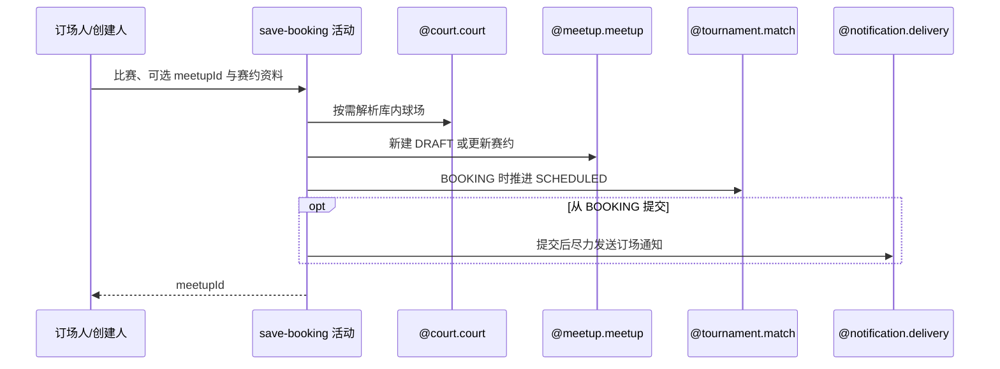

## 概要

新建或更新赛约，并按需推进比赛进入赛约确认。

## 时序图

## 触发条件

登录订场人首次提交/重订赛约，或赛约创建人在 SCHEDULED 阶段修改当前赛约时执行。

## 活动契约

### 入参

| 字段 | 类型 | 必填 | 约束 |
|---|---|---|---|
| `matchId` | 字符串 | 是 | 目标赛事比赛编号 |
| `tournamentId` | 字符串 | 是 | 仅沿用接口必填校验，实际归属取比赛记录 |
| `operatorId` | 字符串 | 是 | 新建或重订时须为订场人，更新时须为赛约创建人 |
| `meetupId` | 字符串 | 否 | 为空时新建；非空时必须等于比赛当前关联赛约 |
| `bookingData` | 赛约资料 | 是 | 时间、场地、费用和参与限制等接口已校验资料 |
| `submittedTime` | 日期时间 | 是 | 从 `BOOKING` 提交时记录并用于通知稳定事件 |

### 成功返回

| 字段 | 类型 | 必填 | 说明 |
|---|---|---|---|
| `meetupId` | 字符串 | 是 | 新建或更新后的赛约业务编号 |

## 异常分支

| 错误标识 | 触发条件 | 来源 |
|---|---|---|
| `TOURNAMENT_ENTRY_NOT_FOUND` | 比赛不存在 | submit-booking 流程 `TOURNAMENT_ENTRY_NOT_FOUND` 一行 |
| `TOURNAMENT_NOT_FOUND` | 比赛实际所属赛事不存在 | submit-booking 流程 `TOURNAMENT_NOT_FOUND` 一行 |
| `TOURNAMENT_INVALID_SCHEDULE_CONFIRM` | 新建时比赛非 `BOOKING` | submit-booking 流程 `TOURNAMENT_INVALID_SCHEDULE_CONFIRM` 一行 |
| `TOURNAMENT_NOT_COURT_BOOKER` | 从 `BOOKING` 提交者不是订场人 | submit-booking 流程 `TOURNAMENT_NOT_COURT_BOOKER` 一行 |
| `MEETUP_NOT_FOUND` | 更新的赛约不存在 | submit-booking 流程 `MEETUP_NOT_FOUND` 一行 |
| `TOURNAMENT_BOOKING_MEETUP_MISMATCH` | 更新赛约不是比赛当前关联 | submit-booking 流程 `TOURNAMENT_BOOKING_MEETUP_MISMATCH` 一行 |
| `NOT_CREATOR` | 更新者不是赛约创建人 | submit-booking 流程 `NOT_CREATOR` 一行 |
| `MEETUP_TOURNAMENT_EDIT_FORBIDDEN` | 更新时比赛非 `BOOKING/SCHEDULED` | submit-booking 流程 `MEETUP_TOURNAMENT_EDIT_FORBIDDEN` 一行 |
| `TOURNAMENT_MATCH_VERSION_CONFLICT` | `BOOKING` 推进时并发冲突 | submit-booking 流程 `TOURNAMENT_MATCH_VERSION_CONFLICT` 一行 |
| `OPERATION_FAILED` | 赛约、比赛或参与关系保存失败 | submit-booking 流程 `OPERATION_FAILED` 一行 |

## 领域依赖

### @court.court

- 输入：`TEXT/MAP` 模式下的可选球场编号与读取当前资料的意图。
- 输出：正常命中时返回场地名称、地址、坐标和区县；未命中时返回空结果供活动降级请求资料，读取异常时给出失败结论。

### @meetup.meetup

- 输入：赛约资料、创建人、比赛参与者，以及新建 `DRAFT` 或更新当前关联赛约的意图。
- 输出：正常时返回已新建或更新的赛约编号；异常时给出赛约不存在、关联或创建人不符、比赛阶段不可编辑、规则或保存失败结论。

### @tournament.match

- 输入：比赛编号、订场人、赛约编号、提交时间和当前版本。
- 输出：正常时从 `BOOKING` 推进为 `SCHEDULED` 并重置确认，或在 `SCHEDULED` 保持确认结果；异常时给出比赛、订场人、状态或版本冲突结论。

### @notification.delivery

- 输入：从 `BOOKING` 提交时由比赛编号和提交时间构造的稳定事件、赛事上下文、其他参与者、语义化订场内容和微信订阅渠道。
- 输出：每个接收人与渠道形成成功、失败或预期跳过的触达结果，重复任务不再次发送；异常时不向赛约提交传播失败，保留可审计结果或应用日志。

## 业务动作

- A1 校验比赛、实际所属赛事、操作者和可选赛约关联。
- A2 解析请求或库内场地并形成最终赛约资料。
- A3 新建赛事草稿赛约或更新当前关联赛约。
- A4 从 `BOOKING` 提交时推进比赛确认，`SCHEDULED` 内修改时保留确认。
- A5 从 `BOOKING` 成功提交后尽力通知其他比赛参与者。

## 详细流程

1. A1 读取比赛、参与者与比赛实际所属赛事；请求 `tournamentId` 不替代实际归属。
2. A2 在 `TEXT/MAP` 且 `courtId` 命中时采用库内场地，否则使用请求资料，不因球场未命中失败。
3. A3 `meetupId` 为空时要求比赛为 `BOOKING` 且本人为订场人，新建 `DRAFT` 赛约并把全部比赛参与者保存为 `JOINED`。
4. A3 `meetupId` 非空时要求赛约存在、与比赛当前关联一致、本人为创建人，比赛为 `BOOKING` 或 `SCHEDULED`，然后更新资料。
5. A4 从 `BOOKING` 提交时比赛进入 `SCHEDULED`、记录提交时间，订场人 `CONFIRMED`、其他人 `PENDING`；`SCHEDULED` 内更新不重置确认，也不比较比赛版本。
6. A3 与 A4 在同一事务保存赛约、比赛和参与关系；只有 `BOOKING→SCHEDULED` 使用比赛版本条件，失败整体回滚。
7. A5 仅从 `BOOKING` 成功提交后，以 `matchId+scheduleSubmittedTime` 构造 `TOURNAMENT_BOOKING_SUBMITTED` 事件，向其他参与者异步尽力通知；`SCHEDULED` 内仅修改资料时不重复通知，最后返回赛约编号。

## 边界情况

- courtId 查不到时不是错误，降级采用请求场地文本/坐标。
- SCHEDULED 内修改可发生在部分参与者已确认之后，确认状态保持。
- 通知在事务提交后且内部容错，不属于成功一致性条件。

## 实现提示

写活动 `reads` 为空；使用已确认 `@court.court` 及待设计的 `@meetup.meetup`、`@tournament.match`。
