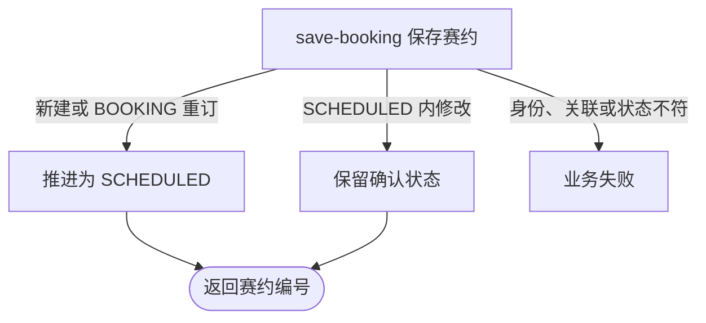

## 概要

让订场人新建或更新赛约，并在提交时将比赛推进到赛约确认。

## 触发

订场人要首次提交或重订赛约，或赛约创建人要在待确认阶段修改已提交资料时发起。

## 接口契约

请求体提供非空 `matchId`、`tournamentId` 及符合校验的时间、场地、人数、NTRP 等赛约资料，`meetupId` 可选。成功返回赛约业务编号。

## 业务活动

- save-booking  新建或更新赛约，并在需要时推进比赛确认状态

## 流程图

## 详细流程

1. 识别当前用户，接收比赛编号、可选赛约编号与时间、场地、费用和参与限制资料。
2. 取得比赛、参与者和比赛实际所属赛事；`TEXT/MAP` 且找到球场时采用库内场地资料，否则使用请求资料。
3. 未传 `meetupId` 时，确认比赛为 `BOOKING` 且本人是订场人，新建 `DRAFT` 赛约并将全部比赛参与者保存为 `JOINED`。
4. 传入 `meetupId` 时，确认赛约存在、与比赛当前关联一致、本人为赛约创建人，且比赛为 `BOOKING` 或 `SCHEDULED`，然后更新赛约资料。
5. 从 `BOOKING` 提交时，将比赛改为 `SCHEDULED`并写提交时间，订场人确认、其他人待确认；`SCHEDULED` 内更新时保留原确认状态。
6. 事务保存赛约、比赛和参与关系；从 `BOOKING` 提交后，以比赛编号和本次提交时间构造稳定事件，向其他参与者尝试发送订场通知，最后返回赛约编号。`SCHEDULED` 内仅修改资料时不会重复通知。

## 异常分支

| 对外失败码 | 触发条件 | 由哪个活动报出 | 补偿动作或超时处理 | 对外提示 |
|---|---|---|---|---|
| 未登录/参数校验错误 | 无有效登录，必填资料缺失，文本、人数、NTRP 或坐标越界 | 入口鉴权与校验 | 不创建/修改 | 统一登录提示／首个无效字段提示 |
| `TOURNAMENT_ENTRY_NOT_FOUND` | 比赛不存在 | save-booking | 不创建/修改 | 报名记录不存在 |
| `TOURNAMENT_NOT_FOUND` | 比赛实际所属赛事不存在 | save-booking | 不创建/修改 | 赛事不存在 |
| `TOURNAMENT_INVALID_SCHEDULE_CONFIRM` | 新建时比赛非 `BOOKING` | save-booking | 不创建赛约 | 当前状态不允许确认赛约 |
| `TOURNAMENT_NOT_COURT_BOOKER` | `BOOKING` 提交者不是订场人 | save-booking | 不创建/推进 | 只有订场人可以提交场地信息 |
| `MEETUP_NOT_FOUND` / `TOURNAMENT_BOOKING_MEETUP_MISMATCH` / `NOT_CREATOR` | 更新的赛约不存在、不是比赛当前关联，或本人非创建人 | save-booking | 不修改 | 约球不存在／约球与比赛不匹配／仅发布者可操作 |
| `MEETUP_TOURNAMENT_EDIT_FORBIDDEN` | 更新时比赛非 `BOOKING/SCHEDULED` | save-booking | 不修改 | 双方已确认赛约，赛事信息无法修改 |
| `TOURNAMENT_MATCH_VERSION_CONFLICT` | `BOOKING` 提交时比赛被并发修改 | save-booking | 事务回滚，保留先保存结果 | 比赛状态已变更，请刷新后重试 |
| 无 | `TEXT/MAP` 的 `courtId` 查不到，或通知不可触达/发送失败 | save-booking | 场地降级使用请求资料；通知提交后容错 | 正常成功 |
| `OPERATION_FAILED` | 赛约、比赛或参与关系未完整保存 | save-booking | 事务回滚，不交付赛约编号 | 系统异常，请稍后重试 |

## 技术线索

- HTTP：`POST /tournament/match/book`
- 请求：`SubmitBookingCmd`；响应：赛约 `String bizId`
- 调用：`TournamentMatchAppService.submitBooking()` → `TournamentMatchFlowService.submitBooking()` → `TournamentMatch.submitBooking()` / `MeetupFactory.createTournamentDraft()`
- 并发：仅 `BOOKING`→`SCHEDULED` 使用 `updateWithVersion()`；`SCHEDULED` 内赛约修改不比较比赛版本
- 事务：`@Transactional(rollbackFor = Exception.class)`；通知提交后异步容错
