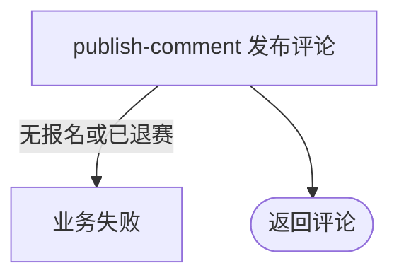

## 概要

让未退赛的赛事参赛者发布一条带发布者快照的赛事评论。

## 触发

当前登录用户作为未退赛参赛者，要发布文本、图片或位置类赛事评论时发起。

## 接口契约

请求体含非空 `tournamentId`、`content` 和 `contentType`，类型为 `TEXT`、`IMAGE` 或 `LOCATION`。成功返回评论编号、赛事、发布者快照、内容、类型和时间。

## 业务活动

- publish-comment  发布赛事评论并更新讨论成员已读未读

## 流程图

## 详细流程

1. 识别当前登录用户，接收非空赛事编号、内容和内容类型。
2. 取得本人在该赛事的报名，确认状态不是 `WITHDRAWN`。
3. 取得本人用户资料，以当前昵称与头像建立评论快照并保存评论。
4. 为已有其他讨论成员增加未读数；将发布者已读位置推进到本条、未读归零，缺少发布者成员关系时补建。
5. 在事务内完成所有保存，签名头像访问地址并返回完整评论。

## 异常分支

| 对外失败码 | 触发条件 | 由哪个活动报出 | 补偿动作或超时处理 | 对外提示 |
|---|---|---|---|---|
| 未登录/参数校验错误 | 无有效登录，或赛事、内容、类型缺失 | 入口鉴权与校验 | 不建立评论 | 统一登录提示／对应字段不能为空 |
| `TOURNAMENT_ENTRY_NOT_FOUND` | 本人在该赛事无报名 | publish-comment | 不建立评论 | 报名记录不存在 |
| `TOURNAMENT_COMMENT_FORBIDDEN` | 本人报名为 `WITHDRAWN` | publish-comment | 不建立评论 | 只有赛事参与者可以查看或发布评论 |
| 登录凭证无效 | 发布者用户资料不存在 | publish-comment | 事务回滚 | 登录凭证无效，请重新登录 |
| `OPERATION_FAILED` | 评论、成员阅读状态保存或头像地址签名失败 | publish-comment | 事务回滚评论和阅读变化 | 系统异常，请稍后重试 |

## 技术线索

- HTTP：`POST /tournament/comment/publish`
- 请求/响应：`TournamentCommentPublishCmd` / `TournamentCommentDTO`
- 调用：`TournamentCommentAppService.publish()` → `TournamentEntryService.getByTournamentAndUser()` → `ChatDomainService.send()`
- 事务：应用服务 `@Transactional`
