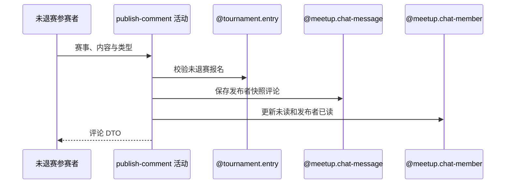

## 概要

发布带用户快照的赛事评论并更新讨论成员阅读状态。

## 时序图

## 触发条件

登录用户以未退赛参赛者身份提交 TEXT、IMAGE 或 LOCATION 评论时执行。

## 活动契约

要求本人报名存在且非 WITHDRAWN；以当前昵称头像生成不可追溯更新的发布快照，保存评论并同步讨论成员阅读状态，返回完整评论。

## 异常分支

| 错误标识 | 触发条件 | 处理 |
|---|---|---|
| `TOURNAMENT_ENTRY_NOT_FOUND` | 本人无赛事报名 | 不建立评论 |
| `TOURNAMENT_COMMENT_FORBIDDEN` | 本人报名已 WITHDRAWN | 不建立评论 |
| 登录凭证无效 | 发布者用户资料不存在 | 事务回滚 |
| `OPERATION_FAILED` | 评论、成员状态保存或头像签名失败 | 评论与阅读变化整体回滚 |

## 领域依赖

### @tournament.entry
- 输入：赛事与当前 userId
- 输出：未退赛参与资格
### @identity.user
- 输入：发布者 userId
- 输出：昵称与头像快照
### @meetup.chat-message
- 输入：赛事频道、发布者快照、内容与类型
- 输出：新评论
### @meetup.chat-member
- 输入：赛事频道及新评论位置
- 输出：成员未读与发布者已读状态

## 业务动作

A1 校验未退赛报名
A2 固化发布者快照
A3 保存赛事评论
A4 推进成员已读未读
A5 签名头像并返回

## 详细流程

1. 要求 tournamentId、content、contentType 非空，类型限 TEXT/IMAGE/LOCATION；本人报名必须存在且非 WITHDRAWN。
2. 读取当前用户资料，把此刻 nickname/avatarKey 固化进评论，之后资料变化不回写历史快照。
3. 保存评论；其他已有成员未读数加一，发布者 lastRead 推进到本条且 unread 归零，发布者关系缺失时补建。
4. 所有保存位于同一事务；之后为快照头像生成访问地址并返回评论编号、内容、类型和时间。

## 边界情况

- 内容只校验非空，不在活动中解释三种类型的内部格式。
- 尚未加入讨论成员的其他参赛者不会在此批量补建。
- 头像签名失败也使事务回滚。

## 实现提示

复用聊天消息/成员聚合承载赛事频道；写活动 `reads` 为空。
