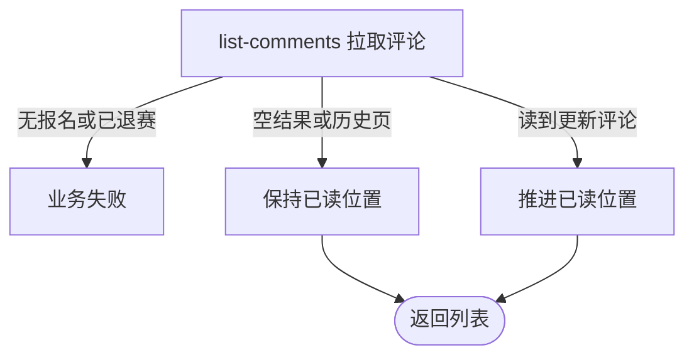

## 概要

向未退赛参赛者倒序交付一批赛事评论，并只向后推进本人已读位置。

## 触发

当前登录且未退赛的参赛者要查看赛事最新评论或继续向前翻阅历史时发起。

## 接口契约

查询参数为必须出现的 `tournamentId`、可选 `beforeCommentId` 和默认 20 的 `limit`。成功返回按新到旧排列的评论列表；无数据为空列表。

## 业务活动

- list-comments  按游标倒序查询评论并按需推进本人已读位置

## 流程图

## 详细流程

1. 识别当前登录用户，接收赛事编号、可选历史评论游标和条数。
2. 取得本人在该赛事的报名，确认其不是 `WITHDRAWN`。
3. 将条数缺省为 20，并限制到 1–100；无游标时从最新评论开始，有游标时只查询编号更早的评论。
4. 按编号从新到旧取得评论，交付发布时昵称与头像快照。
5. 若结果非空且本批最新评论晚于原已读位置，推进已读位置并重算剩余未读；无成员关系时补建。
6. 返回评论列表；无数据时返回空列表且不改阅读状态。

## 异常分支

| 对外失败码 | 触发条件 | 由哪个活动报出 | 补偿动作或超时处理 | 对外提示 |
|---|---|---|---|---|
| 未登录/缺参数 | 无有效登录，或未携带 `tournamentId` 查询参数 | 入口鉴权与参数绑定 | 不交付、不改已读 | 统一登录或缺参提示 |
| `TOURNAMENT_ENTRY_NOT_FOUND` | 赛事编号为空/未知，或本人无该赛事报名 | list-comments | 不交付、不改已读 | 报名记录不存在 |
| `TOURNAMENT_COMMENT_FORBIDDEN` | 本人报名为 `WITHDRAWN` | list-comments | 不交付、不改已读 | 只有赛事参与者可以查看或发布评论 |
| 无 | `limit<1` 或 `limit>100` | list-comments | 分别按 1 或 100 查询 | 无 |
| 无 | 无评论/游标前无数据，或候选已读位置不晚于原值 | list-comments | 返回空列表或历史页，不改已读 | 无 |
| `OPERATION_FAILED` | 评论或阅读数据读写、头像地址签名失败 | list-comments | 事务回滚本次阅读位置变化 | 系统异常，请稍后重试 |

## 技术线索

- HTTP：`GET /tournament/comment/list`
- 查询：`tournamentId`、`beforeCommentId`、`limit`；响应：`TournamentCommentListDTO`
- 调用：`TournamentCommentAppService.list()` → `TournamentEntryService.getByTournamentAndUser()` → `ChatDomainService.listLatest()` → `advanceReadPosition()`
- 事务：应用服务 `@Transactional`
