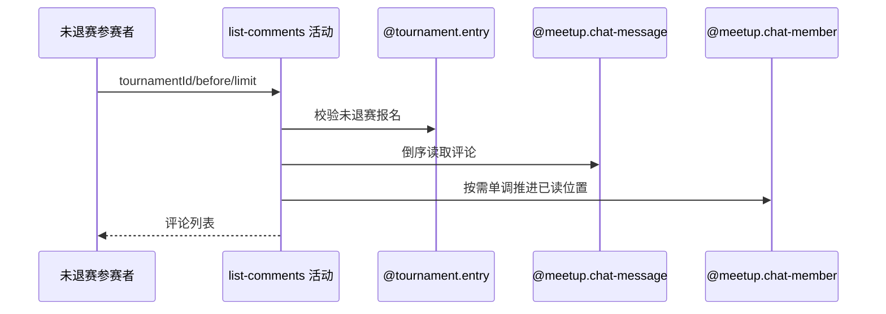

## 概要

倒序拉取赛事评论，并仅向后推进本人阅读位置。

## 时序图

## 触发条件

登录且未退赛的参赛者查看最新或历史赛事评论时执行。

## 活动契约

limit 缺省 20 并钳制 1–100，按评论编号倒序读取 beforeCommentId 之前数据；仅当本批最新评论晚于原位置时推进已读，无数据不修改。

## 异常分支

| 错误标识 | 触发条件 | 处理 |
|---|---|---|
| `TOURNAMENT_ENTRY_NOT_FOUND` | 赛事空/未知或本人无报名 | 不交付、不改已读 |
| `TOURNAMENT_COMMENT_FORBIDDEN` | 本人已 WITHDRAWN | 不交付、不改已读 |
| 无 | 无评论、历史游标前无数据或候选不更新 | 空列表/原已读保持 |
| `OPERATION_FAILED` | 评论/阅读读写或头像签名失败 | 回滚阅读变化，不返回部分列表 |

## 领域依赖

### @tournament.entry
- 输入：赛事与当前 userId
- 输出：未退赛参与资格
### @meetup.chat-message
- 输入：赛事频道、游标与数量
- 输出：发布快照评论列表
### @meetup.chat-member
- 输入：本人及本批最新评论
- 输出：单调推进后的阅读状态

## 业务动作

A1 校验未退赛报名
A2 规范化数量并倒序查询
A3 组装发布快照
A4 单调推进本人已读

## 详细流程

1. 本人报名必须存在且非 WITHDRAWN；limit 为 null 用 20，小于 1 取 1，大于 100 取 100。
2. 无游标从最新开始，有游标只查编号更早评论，按编号新到旧返回，使用发布时昵称头像快照。
3. 结果非空时取本批最新评论；仅它晚于原 lastRead 时推进，并重算剩余未读；成员关系缺失时补建。
4. 空结果或历史页候选不晚于原值时不改变阅读状态；头像签名和阅读写入与活动事务一同收敛。

## 边界情况

- 拉取较老历史页不会把已读位置倒退。
- 返回数量最多 100，无 total/hasMore 契约。
- 历史发布者资料变化不影响快照昵称头像键。

## 实现提示

因会写阅读状态，不按纯查询声明表读取，`reads` 为空；复用聊天领域聚合。
