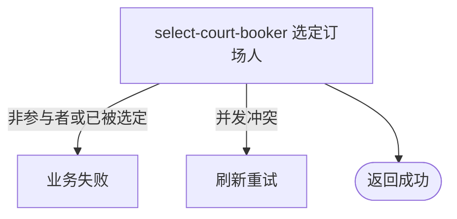

## 概要

让已匹配比赛的参与者认领订场职责，将比赛推进为订场中。

## 触发

处于 `MATCHED` 的赛事比赛中，任一参与者要承担订场职责时发起。

## 接口契约

请求体必须包含非空 `matchId`。成功返回无数据响应。

## 业务活动

- select-court-booker  选定当前参与者为订场人并推进比赛

## 流程图

## 详细流程

1. 识别当前登录用户，接收非空比赛编号。
2. 取得比赛及参与者，确认比赛仍为 `MATCHED`。
3. 确认当前用户属于本场参与者。
4. 将当前用户记为订场人，写入选定时间，将比赛改为 `BOOKING`，以版本条件事务性保存。

## 异常分支

| 对外失败码 | 触发条件 | 由哪个活动报出 | 补偿动作或超时处理 | 对外提示 |
|---|---|---|---|---|
| 未登录/参数校验错误 | 无有效登录，或比赛编号空白 | 入口鉴权与校验 | 不修改 | 统一登录提示／比赛ID不能为空 |
| `TOURNAMENT_ENTRY_NOT_FOUND` | 比赛不存在 | select-court-booker | 不创建或修改比赛 | 报名记录不存在 |
| `TOURNAMENT_COURT_BOOKER_ALREADY_SELECTED` | 比赛不是 `MATCHED` | select-court-booker | 保留已有订场人/状态，不幂等 | 订场人已被选定 |
| `TOURNAMENT_INVALID_COURT_BOOKER` | 当前用户不属于参与者 | select-court-booker | 比赛保持 `MATCHED` | 只有待选订场人才能认领 |
| `TOURNAMENT_MATCH_VERSION_CONFLICT` | 另一参与者或操作先修改比赛 | select-court-booker | 本次事务回滚，保留先保存结果 | 比赛状态已变更，请刷新后重试 |
| `OPERATION_FAILED` | 订场人、选定时间或状态保存失败 | select-court-booker | 事务回滚 | 系统异常，请稍后重试 |

## 技术线索

- HTTP：`POST /tournament/match/court-booker`
- 请求：`SelectCourtBookerCmd`
- 调用：`TournamentMatchAppService.selectCourtBooker()` → `TournamentMatchFlowService.selectCourtBooker()` → `TournamentMatch.selectCourtBooker()`
- 并发：`TournamentMatchRepository.updateWithVersion()`
- 事务：`@Transactional(rollbackFor = Exception.class)`
