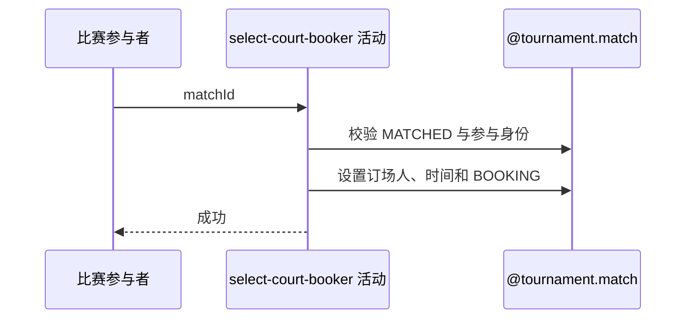

## 概要

选定当前参与者为订场人，并把比赛推进到订场中。

## 时序图

## 触发条件

MATCHED 比赛的任一参与者认领订场职责时执行。

## 活动契约

仅允许参与者在比赛仍为 MATCHED 时认领；记录当前用户和选定时间，推进 BOOKING，重复或晚到请求不幂等。

## 异常分支

| 错误标识 | 触发条件 | 处理 |
|---|---|---|
| `TOURNAMENT_ENTRY_NOT_FOUND` | 比赛不存在 | 不修改 |
| `TOURNAMENT_COURT_BOOKER_ALREADY_SELECTED` | 比赛已非 MATCHED | 保留先有状态，不幂等 |
| `TOURNAMENT_INVALID_COURT_BOOKER` | 本人不在参与者中 | 保持 MATCHED |
| `TOURNAMENT_MATCH_VERSION_CONFLICT`/`OPERATION_FAILED` | 并发或保存失败 | 事务回滚，刷新重试 |

## 领域依赖

### @tournament.match

- 输入：MATCHED 比赛、当前 userId 与版本
- 输出：订场人、选定时间和 BOOKING 状态

## 业务动作

A1 校验比赛仍待认领
A2 校验参与身份
A3 设置订场人与时间
A4 版本化推进 BOOKING

## 详细流程

1. 读取比赛及参与者，比赛不存在复用报名不存在错误。
2. 要求状态精确 MATCHED；即使同一用户已先认领，晚到调用也报已选定，不作幂等成功。
3. 当前 userId 必须属于参与者；通过后设为 courtBookerId，记录当前时间并改为 BOOKING。
4. 以版本条件同事务保存，两个参与者并发认领只保留先成功结果。

## 边界情况

- 参与者之间无优先级，首次成功写入者获订场职责。
- 失败响应要求客户端刷新比赛状态。
- 成功仅返回 data=null。

## 实现提示

写入使用 `@tournament.match`，`reads` 为空。
