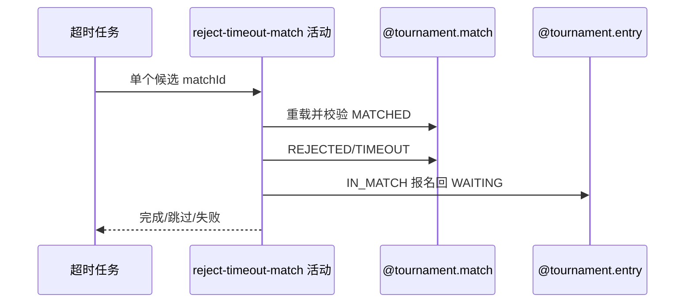

## 概要

逐场终止选订场人超时比赛，并让有效报名回到匹配池。

## 时序图

## 触发条件

任务扫描到 MATCHED 且 matchedTime 不晚于当前时间减三天的单场候选时执行。

## 活动契约

逐场重载；已变状态幂等跳过，否则以版本条件改 REJECTED/TIMEOUT，仅关闭 DRAFT 赛约并把 IN_MATCH 报名退回 WAITING。

## 异常分支

| 错误标识 | 触发条件 | 处理 |
|---|---|---|
| 跳过 | 重载后已非 MATCHED | 不修改，继续下一场 |
| `TOURNAMENT_ENTRY_NOT_FOUND` | 比赛或任一参与者报名不存在 | 本场回滚，继续下一场 |
| `TOURNAMENT_MATCH_VERSION_CONFLICT` | 并发改变比赛 | 本场回滚，不覆盖先变化 |
| `OPERATION_FAILED` | 比赛、赛约或报名保存失败 | 本场回滚，继续下一场 |

## 领域依赖

### @tournament.match
- 输入：超时 MATCHED 比赛与版本
- 输出：REJECTED/TIMEOUT
### @tournament.entry
- 输入：参与者报名
- 输出：仅 IN_MATCH 退回 WAITING
### @meetup.meetup
- 输入：关联赛约
- 输出：仅 DRAFT 时关闭

## 业务动作

A1 重载并幂等复核
A2 版本化超时拒绝比赛
A3 关闭草稿赛约
A4 释放有效报名

## 详细流程

1. 外层扫描固定三天阈值；活动逐场重载比赛与参与者，非 MATCHED 直接跳过。
2. 设置 status=REJECTED、rejectReason=TIMEOUT，以版本条件保存。
3. 关联赛约存在且 DRAFT 时关闭；缺失或其他状态保持原样。
4. 逐个报名仅把 IN_MATCH 改 WAITING，其他状态不变；任一报名缺失使本场回滚。
5. 每场独立事务，外层按场捕获异常并继续其他候选。

## 边界情况

- 扫描阈值固定三天，不使用用户拒赛的配置小时数。
- 单场失败无即时补偿，下轮仍满足条件可重试。
- 无候选时静默完成。

## 实现提示

写活动 `reads` 为空；定时批量的逐场隔离属于编排边界。
