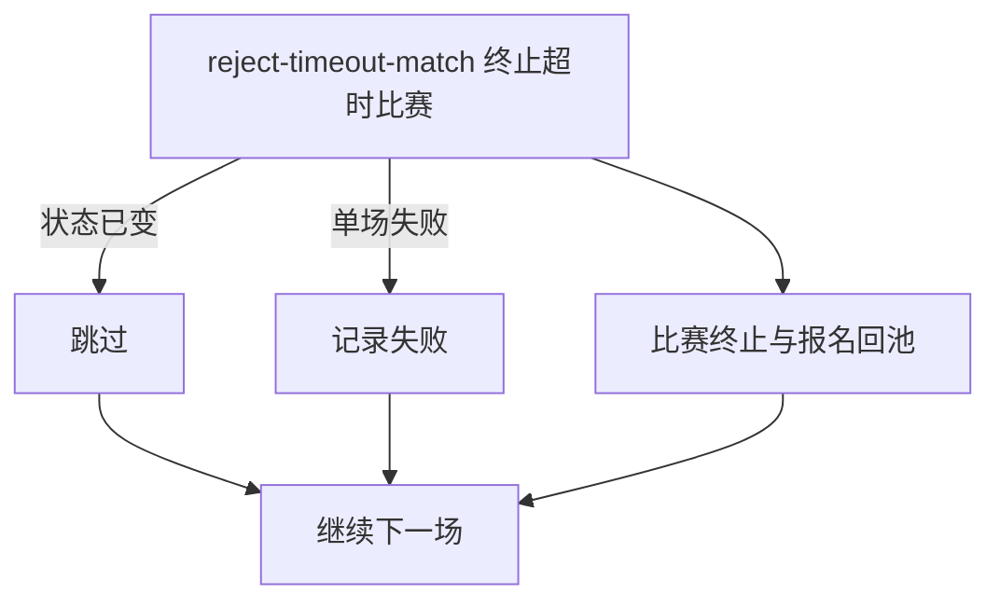

## 概要

定时终止匹配后超过三天仍未选订场人的比赛，并让有效报名回池。

## 触发

`job.tournamentMatchTimeout.enabled=true` 时，按配置表达式触发；默认每两小时一次。

## 接口契约

无同步入参和用户响应。每轮处理匹配时间不晚于当前时间减三天的 `MATCHED` 比赛。

## 业务活动

- reject-timeout-match  终止单场选订场人超时比赛并让报名回池

## 流程图

## 详细流程

1. 任务启用时按配置 cron 扫描 `MATCHED` 且 `matchedTime` 不晚于当前时间减三天的比赛。
2. 逐场重新加载比赛与参与者；已不是 `MATCHED` 时幂等跳过。
3. 将比赛改为 `REJECTED`，将拒绝理由编码记为 `TIMEOUT`，以版本条件保存。
4. 若存在关联赛约且仍为 `DRAFT`，将其关闭；将同场参与者中仍为 `IN_MATCH` 的报名改为 `WAITING`。
5. 每场独立事务提交；单场失败记录后继续处理其他候选比赛。

## 异常分支

| 对外失败码 | 触发条件 | 由哪个活动报出 | 补偿动作或超时处理 | 对外提示 |
|---|---|---|---|---|
| 无 | 本轮无候选比赛 | 批量扫描 | 无变更，正常结束 | 无 |
| 无 | 逐场处理时已不是 `MATCHED` | reject-timeout-match | 幂等跳过 | 无 |
| `TOURNAMENT_ENTRY_NOT_FOUND` | 比赛或任一参与者报名不存在 | reject-timeout-match | 该场事务回滚，继续其他场 | 无 |
| `TOURNAMENT_MATCH_VERSION_CONFLICT` | 比赛已被并发修改 | reject-timeout-match | 不覆盖先变化，该场回滚并继续 | 无 |
| 无 | 赛约缺失/非 `DRAFT`，或某报名非 `IN_MATCH` | reject-timeout-match | 保留该对象原状态，继续完成该场 | 无 |
| `OPERATION_FAILED` | 比赛、赛约或报名未完整保存 | reject-timeout-match | 该场回滚，不影响其他场 | 无 |

## 技术线索

- Job：`TournamentMatchTimeoutJob.processTimeoutMatches()` 中的 `processMatchedTimeout()`
- 开关：`job.tournamentMatchTimeout.enabled=true`
- 调度：`${job.tournamentMatchTimeout.cron:0 0 */2 * * ?}`
- 调用：`TournamentMatchRepository.findTimeoutMatches(MATCHED, now-3days)` → `TournamentMatchFlowService.handleMatchedTimeout()` → `settleRejectedMatch()`
- 事务：每场 `@Transactional(rollbackFor = Exception.class)`；Job 按场 `try/catch`
