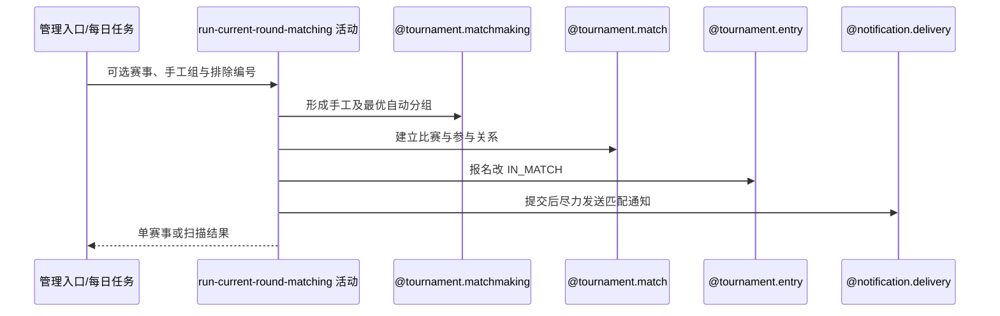

## 概要

编排赛事当前轮次，建立比赛并将匹配报名置为比赛中。

## 时序图

## 触发条件

运营手动执行，或启用任务扫描到 ACTIVE 且资格赛开始时间已到的赛事时执行。

## 活动契约

### 入参

| 字段 | 类型 | 必填 | 约束 |
|---|---|---|---|
| `tournamentId` | 字符串 | 否 | 指定模式必填；为空时扫描全部到期激活赛事 |
| `manualGroups` | 二维参赛编号列表 | 否 | 非空时须指定赛事；每组人数完整且编号在本批唯一 |
| `excludedEntryNos` | 参赛编号列表 | 否 | 仅在本次计算中临时排除，不持久化 |

### 成功返回

| 字段 | 类型 | 必填 | 说明 |
|---|---|---|---|
| 无 | - | - | 不返回比赛、失败赛事或通知明细 |

## 异常分支

| 错误标识 | 触发条件 | 来源 |
|---|---|---|
| `PARAM_ERROR` | 指定赛事缺少编号、当前轮次为空或手工组结构无效 | run-matching 流程 `PARAM_ERROR` 一行 |
| `TOURNAMENT_NOT_FOUND` | 指定赛事不存在，或手工分组没有有效赛事编号 | run-matching 流程 `TOURNAMENT_NOT_FOUND` 一行 |
| `TOURNAMENT_ENTRY_NOT_FOUND` | 手工编号无效、非当前轮次 WAITING、被排除或双打成员未齐 | run-matching 流程 `TOURNAMENT_ENTRY_NOT_FOUND` 一行 |
| 无可行分组 | 时间、地区、历史对阵约束无法组成完整组 | 两个上游流程的无可行完整分组一行 |
| `OPERATION_FAILED` | 指定赛事读取、组装或保存失败 | run-matching 流程 `OPERATION_FAILED` 一行 |
| 全量中单赛事异常 | 全量或定时扫描的某赛事处理失败 | 两个上游流程的单赛事异常一行 |

## 领域依赖

### @tournament.matchmaking

- 输入：完整候选队、排除项、手工组及历史约束
- 输出：覆盖最多且择优的比赛分组

### @tournament.match

- 输入：赛事轮次、分组与比赛序号
- 输出：比赛及参与关系，BOOKING 或 MATCHED

### @tournament.entry

- 输入：组内 WAITING 报名
- 输出：IN_MATCH 状态

### @notification.delivery

- 输入：新比赛参赛者和匹配场景
- 输出：提交后尽力通知

## 业务动作

- A1 选择赛事和当前轮次候选。
- A2 校验并落地手工组。
- A3 优化自动分组。
- A4 建立比赛并锁定报名。
- A5 去重发送匹配通知。

## 详细流程

1. A1 全量/定时选择 ACTIVE 且资格赛开始时间已到赛事；指定模式读取目标。每个赛事必须有 currentRound。
2. A1 只从报名轮次等于赛事当前轮次的 WAITING 报名按参赛编号组队；已晋级到更晚轮次的 WAITING 报名不进入候选，另排除临时编号和成员未齐的双打队伍。
3. A2 手工组须人数完整、编号非空不重复且均在候选池，先直接落地。
4. A3 剩余队伍按共同时间、地区和已完成历史对阵寻找覆盖最多组合，再按订场能力、性别构成和报名时间择优。
5. A4 每组创建比赛/参与关系并分配序号，组内报名改 IN_MATCH；恰有一名可订场成员时直接 BOOKING，否则 MATCHED。
6. A4 单赛事在一个事务保存。指定模式失败对外报错；全量与定时逐赛事捕获继续，已成功赛事保留。
7. A5 每场新比赛提交后，以 `TOURNAMENT_MATCHED:matchId` 事件向本场去重参与者直接尝试匹配通知；未订阅记 `SKIPPED`，发送失败记 `FAILED`，均不回滚匹配。

## 边界情况

- 手工分组与临时排除只影响本次，不持久化策略。
- 无完整可行组属于正常结果，不返回未匹配明细。
- 已晋级报名等待赛事整体推进，不会被当前轮再次匹配。
- HTTP 全量入口仅用本进程 synchronized，不能跨实例串行。

## 实现提示

写活动 `reads` 为空；匹配算法注册为领域服务但本阶段不设计。
