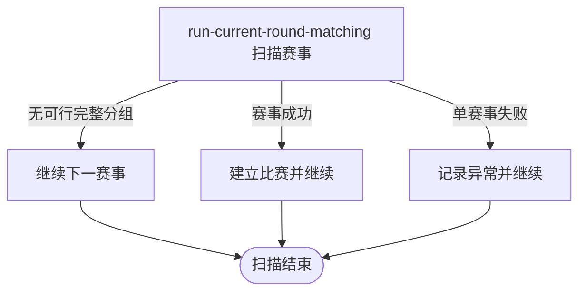

## 概要

每日扫描已到匹配时间的激活赛事，自动编排各赛事当前轮次。

## 触发

任务在 `job.tournamentMatch.enabled=true` 时注册，按 `job.tournamentMatch.cron` 执行，缺省表达式为 `0 0 2 * * ?`。调度未指定时区，按应用运行时默认时区解释；一次扫描触发时所有 `ACTIVE` 且资格赛开始时间已到的赛事。

## 接口契约

定时入口不接收参数，也不交付比赛清单、失败赛事或通知结果。它不支持手工分组和临时排除；每次以数据库当时状态重新计算。

## 业务活动

- run-current-round-matching  编排当前轮次并建立比赛

## 流程图

## 详细流程

1. 任务仅在 `job.tournamentMatch.enabled=true` 时注册，按配置的 cron 触发，缺省每天凌晨 2 点执行。
2. 以触发时刻筛选全部 `ACTIVE` 且资格赛开始时间已到的赛事。
3. 逐个赛事读取当前轮次，从该轮 `WAITING` 报名组成完整参赛队，跳过成员未齐的双打队伍。
4. 按共同时间、地区和已完成历史对阵形成覆盖最多的可行组合，并按订场能力、性别构成和报名时间择优。
5. 为每组创建比赛及参与关系、分配比赛序号，并将报名改为 `IN_MATCH`；唯一可订场人明确时进入 `BOOKING`，否则进入 `MATCHED`。
6. 对本赛事新比赛涉及的不同参赛者尝试发送匹配成功通知。
7. 单个赛事失败时记录异常并继续下一个赛事，扫描完成后任务结束。

## 异常分支

| 对外失败码 | 触发条件 | 由哪个活动报出 | 补偿动作或超时处理 | 对外提示 |
|---|---|---|---|---|
| 任务未注册 | `job.tournamentMatch.enabled` 未设为 `true` | 调度装配 | 不执行扫描 | 无对外提示 |
| 无待处理赛事 | 没有 `ACTIVE` 且资格赛开始时间已到的赛事 | run-current-round-matching | 正常结束 | 无对外提示 |
| 无可行完整分组 | 某赛事候选不足，或时间、地区、历史对阵约束不能组成完整组 | run-current-round-matching | 报名保持 `WAITING`，继续其他赛事 | 无对外提示 |
| 当前轮次缺失 | 扫描命中的赛事没有 `currentRound` | run-current-round-matching | 该赛事不建立比赛，记录异常并继续 | 无对外提示 |
| 单赛事处理异常 | 某赛事读取、匹配或持久化未完整成功 | run-current-round-matching | 该赛事事务回滚；其他赛事继续，已提交结果保留 | 无对外提示 |

## 技术线索

- 调度：`TournamentMatchJob.run()`
- 开关：`job.tournamentMatch.enabled=true`
- cron：`${job.tournamentMatch.cron:0 0 2 * * ?}`
- 调用：`TournamentAdminAppService.runTournamentMatch()` → `RunCurrentRoundMatchingActivity.executeScheduled()` → `TournamentBatchMatchService.matchCurrentRound()` → `TournamentMatchmakingService.match()` → `TournamentMatchAssembleService.assemble()`
- 隔离：应用服务逐赛事 `try/catch`，领域服务以单赛事 `@Transactional` 保存
- 通知：`NoticeScene.TOURNAMENT_MATCHED`，匹配落地后按用户去重异步发送
