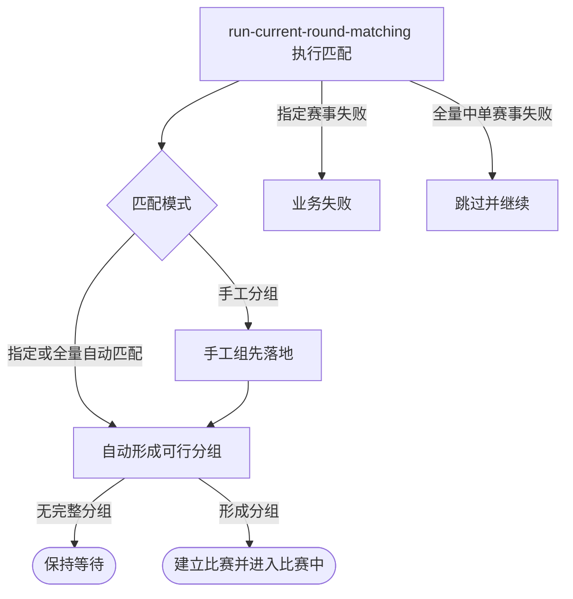

## 概要

让运营按指定赛事、手工分组或全量扫描方式执行当前轮次匹配。

## 触发

运营需要立即为一个指定赛事编排当前轮次，覆盖部分手工分组，或主动扫描全部已到匹配时间的赛事。

## 接口契约

请求体可省略。`tournamentId` 指定单个赛事；`manualGroups` 为按参赛编号组成的比赛列表，非空时必须同时指定赛事；`excludedEntryNos` 只在本次计算中临时排除编号。成功仅返回无数据响应，不返回比赛清单或失败明细。

## 业务活动

- run-current-round-matching  编排当前轮次并建立比赛

## 流程图

## 详细流程

1. 接收可选的赛事编号、手工分组和本次临时排除的参赛编号；按参数组合选择手工指定、指定赛事自动匹配或全量扫描模式。
2. 全量模式筛选所有 `ACTIVE` 且资格赛开始时间已到的赛事；指定模式读取目标赛事及其当前轮次。
3. 从当前轮次的 `WAITING` 报名中按参赛编号组队，排除本次指定编号和成员未齐的双打队伍。
4. 若提供手工分组，先校验每组完整、编号唯一且均来自候选池，直接落地这些分组；剩余队伍继续自动匹配。
5. 自动匹配按共同时间、地区和历史对阵形成覆盖最多的可行组合，并按订场能力、性别构成和报名时间择优。
6. 为每组创建比赛及参与关系、分配比赛序号，并将组内报名改为 `IN_MATCH`；恰有一名可订场成员时比赛直接进入 `BOOKING`，否则进入 `MATCHED`。
7. 对新比赛涉及的不同参赛者尝试发送匹配成功通知；指定模式处理完后返回，全量模式逐赛事隔离失败并在扫描结束后返回。

## 异常分支

| 对外失败码 | 触发条件 | 由哪个活动报出 | 补偿动作或超时处理 | 对外提示 |
|---|---|---|---|---|
| 无权限/请求参数无效 | 无运营权限或请求体无法解析 | 入口鉴权与解析 | 不读取/修改 | 统一权限／参数提示 |
| `PARAM_ERROR` | 指定模式缺少赛事编号，赛事当前轮次为空，手工组人数错误、含空编号或本批编号重复 | run-current-round-matching | 指定赛事本次事务回滚 | 参数错误 |
| `TOURNAMENT_NOT_FOUND` | 指定赛事不存在，或手工分组未提供有效赛事编号 | run-current-round-matching | 不建立比赛 | 赛事不存在 |
| `TOURNAMENT_ENTRY_NOT_FOUND` | 手工编号不存在、不在当前轮次、不是 `WAITING`、被临时排除或双打成员未齐 | run-current-round-matching | 指定赛事本次事务回滚 | 报名记录不存在 |
| 无可行完整分组 | 候选队伍不足，或时间、地区、历史对阵约束无法形成完整组 | run-current-round-matching | 报名保持 `WAITING`，正常返回 | 匹配执行成功 |
| `OPERATION_FAILED` | 指定赛事读取、比赛或参与关系创建、报名保存未完整成功 | run-current-round-matching | 指定赛事本次事务回滚 | 系统异常，请稍后重试 |
| 全量中单赛事异常 | 全量扫描的某一赛事校验、匹配、保存或通知发生异常 | run-current-round-matching | 该赛事未提交的变化回滚；记录异常并继续其他赛事 | 接口最终仍返回成功 |
| 通知不可用 | 无订阅授权、无接收身份或微信发送失败 | 匹配成功通知 | 不回滚比赛和报名；跳过或记录失败 | 匹配执行成功 |

## 技术线索

- HTTP：`POST /tournament/admin/match/run`
- 请求：可选 `TournamentMatchRunCmd`
- 入口分派：`TournamentAdminController.runTournamentMatch()`
- 调用：`TournamentAdminAppService.runTournamentMatch*()` → `TournamentBatchMatchService.matchCurrentRound*()` → `TournamentMatchingService.group()` → `TournamentMatchAssembleService.assemble()`
- 单赛事事务：`TournamentBatchMatchService.matchCurrentRound()`／`matchCurrentRoundManually()` 的 `@Transactional`
- 全量隔离：应用服务逐赛事 `try/catch`；入口方法以 `synchronized` 串行化本进程调用
- 通知：`NoticeScene.TOURNAMENT_MATCHED`，匹配落地后按用户去重异步发送
