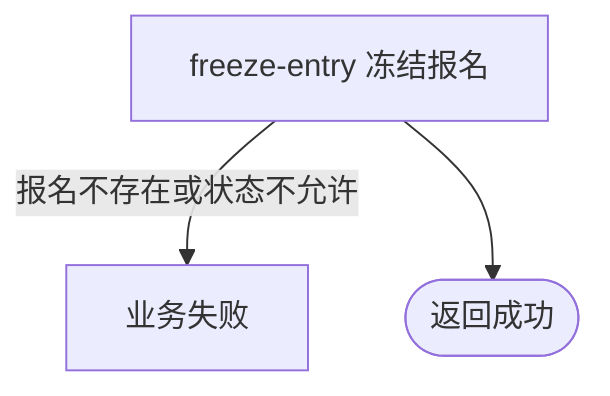

## 概要

由运营将指定用户在指定赛事中处于等待匹配的报名冻结，使其暂时移出匹配池。

## 触发

持有后台共享访问密钥的运营人员要将某位用户的待匹配报名暂时移出匹配池时发起。

## 接口契约

请求体必须包含非空 `tournamentId` 和 `userId`。成功返回标准成功响应，`data=null`。

## 业务活动

- freeze-entry  冻结指定用户的待匹配报名

## 流程图

## 详细流程

1. 后台共享 API Key 鉴权后，接收非空赛事编号和用户编号。
2. 按赛事编号与用户编号查找唯一报名，不存在则失败。
3. 确认报名状态为 `WAITING`；其他状态均拒绝。
4. 将该报名状态改为 `FROZEN`，在事务内保存并返回无数据成功响应。

## 异常分支

| 对外失败码 | 触发条件 | 由哪个活动报出 | 补偿动作或超时处理 | 对外提示 |
|---|---|---|---|---|
| 无权限 | 后台 API Key 未配置、缺失或不匹配 | 后台鉴权 | 不读取、不修改报名 | 无权限访问 |
| 参数校验错误 | 赛事编号空白 | 入口校验 | 不修改报名 | 赛事ID不能为空 |
| 参数校验错误 | 用户编号空白 | 入口校验 | 不修改报名 | 用户ID不能为空 |
| `TOURNAMENT_ENTRY_NOT_FOUND` | 指定赛事与用户下无报名 | freeze-entry | 不创建或修改任何报名 | 报名记录不存在 |
| `TOURNAMENT_ENTRY_STATUS_ILLEGAL` | 报名状态不是 `WAITING`，包括已是 `FROZEN` | freeze-entry | 保持原状态，不按幂等成功 | 报名当前状态不允许该操作 |
| `OPERATION_FAILED` | 保存异常 | freeze-entry | 事务回滚，报名保持原状态 | 系统异常，请稍后重试 |

## 技术线索

- HTTP：`POST /tournament/admin/entry/freeze`
- 请求：`TournamentEntryFreezeCmd`
- 调用：`TournamentAdminAppService.freezeEntry()` → `TournamentEntryService.getByTournamentAndUser()` → `TournamentEntryService.freeze()` → `TournamentEntry.freeze()`
- 事务：应用服务 `@Transactional`
