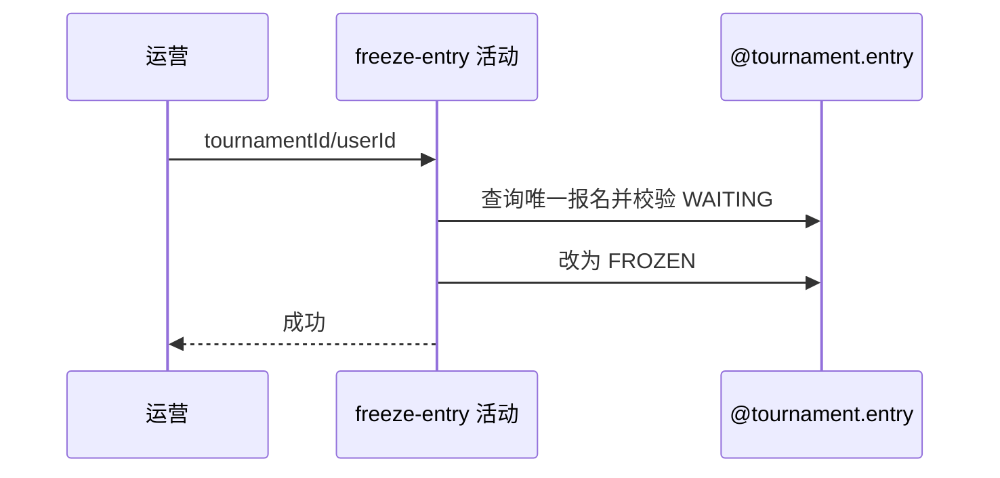

## 概要

把指定用户的待匹配报名冻结并移出匹配池。

## 时序图

## 触发条件

通过后台共享 API Key 的运营提交非空赛事和用户编号时执行。

## 活动契约

只允许唯一报名从 WAITING 转为 FROZEN；报名不存在或已是 FROZEN/其他状态均失败，不作幂等成功。

## 异常分支

| 错误标识 | 触发条件 | 处理 |
|---|---|---|
| `TOURNAMENT_ENTRY_NOT_FOUND` | 指定赛事用户无报名 | 不创建、不修改 |
| `TOURNAMENT_ENTRY_STATUS_ILLEGAL` | 状态不是 WAITING | 保持原状态 |
| `OPERATION_FAILED` | 保存失败 | 事务回滚 |

## 领域依赖

### @tournament.entry

- 输入：赛事、用户与当前报名状态
- 输出：FROZEN 报名

## 业务动作

A1 按赛事用户取得报名
A2 校验 WAITING
A3 冻结报名

## 详细流程

1. 入口先通过后台 API Key 并校验 tournamentId/userId 非空。
2. 按赛事和用户取得唯一报名，不存在不自动创建。
3. 仅 WAITING 可转 FROZEN，包括重复冻结在内的其他状态均报非法。
4. 在应用事务保存，成功 data=null，报名阶段、轮次和偏好不变。

## 边界情况

- 冻结不取消已建立比赛；因此只允许 WAITING。
- 重复冻结不是幂等成功。
- 解冻由参赛者另一路径完成。

## 实现提示

写入使用 `@tournament.entry`，`reads` 为空。
