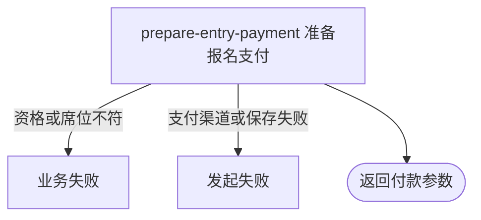

## 概要

为待支付的赛事报名建立或复用微信支付单，向当前参赛者交付小程序付款参数。

## 触发

当前登录参赛者的赛事报名已进入待支付，需要取得微信小程序付款参数时发起。

## 接口契约

请求体必须包含非空 `tournamentId`。成功返回 `paymentId`、`prepayId`、`timeStamp`、`nonceStr`、`packageVal`、`signType` 与 `paySign`。

## 业务活动

- prepare-entry-payment  建立或复用报名费支付单并交付微信付款参数

## 流程图

## 详细流程

1. 登录参赛者提交非空赛事编号，系统取得赛事与本人报名。
2. 确认报名为 `PAYING`，且赛事已锁定正赛席位数小于总签位数。
3. 以该报名和付款人取得可用支付单；无可用单时按赛事报名费建立微信 `PENDING` 支付单，原待支付单过期时先关闭再新建。
4. 确认当前用户是付款人，取得微信小程序 `openid`，调用微信支付获取或基于有效 `prepayId` 重新生成付款签名。
5. 保存预支付编号及有效期，返回支付单编号与微信付款参数；报名仍为 `PAYING`，本流程不确认付款成功。

## 异常分支

| 对外失败码 | 触发条件 | 由哪个活动报出 | 补偿动作或超时处理 | 对外提示 |
|---|---|---|---|---|
| 未登录/参数校验错误 | 无有效登录用户，或赛事编号空白 | 入口校验 | 不建单 | 按统一鉴权结果／赛事ID不能为空 |
| `TOURNAMENT_NOT_FOUND` | 赛事不存在 | prepare-entry-payment | 不建单 | 赛事不存在 |
| `TOURNAMENT_ENTRY_NOT_FOUND` | 本人在该赛事无报名 | prepare-entry-payment | 不建单 | 报名记录不存在 |
| `TOURNAMENT_ENTRY_STATUS_ILLEGAL` | 本人报名不是 `PAYING` | prepare-entry-payment | 报名和既有支付单不变 | 报名当前状态不允许该操作 |
| `TOURNAMENT_SLOTS_FULL` | 已锁定席位数达到总签位数 | prepare-entry-payment | 不新建支付单 | 正赛席位已满，暂时无法支付 |
| 无权操作 | 当前用户不是所得支付单的付款人 | prepare-entry-payment | 不交付付款参数 | 无权操作该支付单 |
| 微信授权/渠道不可用 | 无小程序 `openid`，或微信支付配置、渠道未就绪 | prepare-entry-payment | 不交付付款参数 | 微信授权失败／暂不支持该支付渠道 |
| `OPERATION_FAILED` | 微信下单拒绝、无可用结果，或本地保存失败 | prepare-entry-payment | 本地事务回滚；微信侧已发生的下单/关单不可由本地回滚，不确认发起成功 | 系统异常，请稍后重试 |

## 技术线索

- HTTP：`POST /tournament/entry/pay`
- 请求/响应：`TournamentEntryPayCmd` / `PrepayDTO`
- 调用：`TournamentEntryAppService.pay()` → `TournamentPaymentService.createEntryOrder()` → `PaymentDomainService.createSingle()` → `PaymentDomainService.prepay()`
- 事务：应用服务 `@Transactional`；微信调用不参与本地事务
