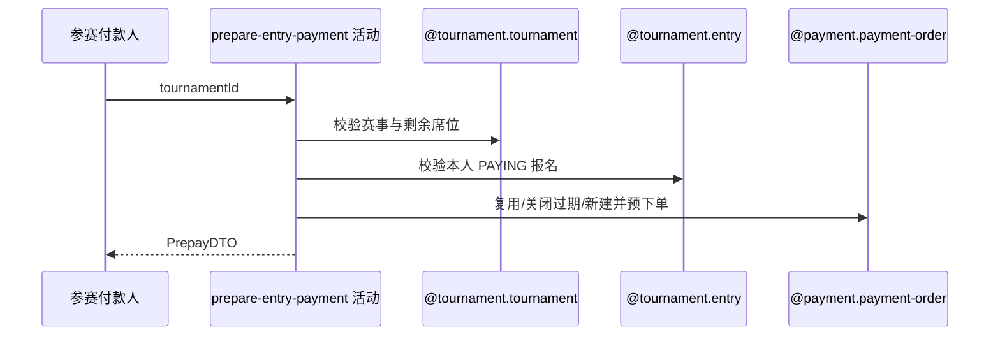

## 概要

建立或复用报名费支付单并交付微信小程序付款参数。

## 时序图

## 触发条件

登录参赛者的报名处于 PAYING 且正赛仍有锁定席位时执行。

## 活动契约

为本人报名取得可用微信 PENDING 支付单；过期单先关闭再新建，调用微信预下单或基于有效 prepayId 重签，返回付款参数但不确认支付。

## 异常分支

| 错误标识 | 触发条件 | 处理 |
|---|---|---|
| `TOURNAMENT_NOT_FOUND`/`TOURNAMENT_ENTRY_NOT_FOUND` | 赛事或本人报名不存在 | 不建单 |
| `TOURNAMENT_ENTRY_STATUS_ILLEGAL` | 报名不是 PAYING | 既有对象不变 |
| `TOURNAMENT_SLOTS_FULL` | 锁定席位已达总签位 | 不新建支付单 |
| 无权操作/微信授权或渠道不可用 | 付款人不符、openid/配置缺失 | 不交付参数 |
| `OPERATION_FAILED` | 微信拒绝、空结果或本地保存失败 | 本地回滚；微信侧下单/关单不可回滚 |

## 领域依赖

### @tournament.tournament
- 输入：赛事编号
- 输出：报名费、签位和当前锁定数
### @tournament.entry
- 输入：赛事与当前用户
- 输出：PAYING 报名
### @payment.payment-order
- 输入：报名、付款人、金额和微信身份
- 输出：可用支付单与小程序付款参数

## 业务动作

A1 校验报名支付资格与席位
A2 取得或轮换支付单
A3 校验付款人与微信身份
A4 预下单或重签参数
A5 保存预支付信息并返回

## 详细流程

1. 取得赛事与本人报名，要求报名 PAYING，且已锁定正赛席位数小于总签位数。
2. 按报名和付款人查可用支付单；无可用单按赛事报名费建微信 PENDING 单，原待支付单过期先请求关闭再新建。
3. 当前用户必须是支付单 payer；取得小程序 openid，渠道与配置必须可用。
4. 无有效 prepayId 时调用微信下单；仍有效时可重新生成时间戳、随机串和签名。
5. 保存 prepayId 与有效期，返回 paymentId 等参数；报名保持 PAYING，支付成功由回执/同步流程确认。

## 边界情况

- 本地事务不能撤销微信侧已完成的下单或关单。
- 取得付款参数不是付款成功，也不锁定额外席位。
- 重复请求可复用有效支付单和预支付结果。

## 实现提示

写活动 `reads` 为空；微信支付 RPC snapshot 当前缺失，契约依据 Java 调用链。
