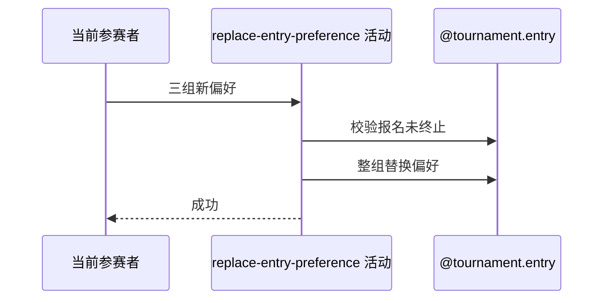

## 概要

整组替换本人报名的地区、订场能力和可比赛时间偏好。

## 时序图

## 触发条件

登录参赛者提交非空赛事、地区列表、订场能力和时间列表时执行。

## 活动契约

本人报名存在且非 ELIMINATED/WITHDRAWN 时，以本次三组值整体覆盖旧偏好；报名状态和其他字段不变。

## 异常分支

| 错误标识 | 触发条件 | 处理 |
|---|---|---|
| `TOURNAMENT_ENTRY_NOT_FOUND` | 本人无指定赛事报名 | 不创建报名 |
| `TOURNAMENT_ENTRY_STATUS_ILLEGAL` | 报名已 ELIMINATED 或 WITHDRAWN | 保留原偏好 |
| `OPERATION_FAILED` | 保存失败 | 事务回滚，保留原偏好 |

## 领域依赖

### @tournament.entry

- 输入：本人报名与三组新偏好
- 输出：整体替换后的报名

## 业务动作

A1 取得本人报名
A2 校验报名未终止
A3 整组替换匹配偏好

## 详细流程

1. 入口要求 tournamentId、至少一项 preferredDistricts、courtAbility、至少一项 availableTimes。
2. 按赛事和当前用户取得报名，不存在不自动创建。
3. ELIMINATED/WITHDRAWN 拒绝；PAYING、WAITING、FROZEN、IN_MATCH 等其余状态可更新。
4. 三组偏好整体替换而非合并，在事务内保存；状态、赛段、轮次和计数均不变。

## 边界情况

- 列表内重复值是否保留由请求模型/持久化现状决定，不在活动额外去重。
- 冻结或比赛中的报名仍可更新未来匹配偏好。
- 空列表在入口被拒绝，无法用本活动清空偏好。

## 实现提示

写入使用 `@tournament.entry`，`reads` 为空。
