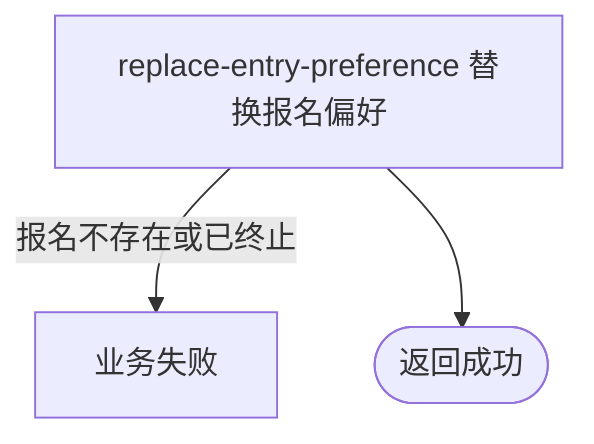

## 概要

让当前参赛者整组替换本人赛事报名的区域、订场能力和可比赛时间偏好。

## 触发

当前登录参赛者要更新本人已有赛事报名的后续匹配偏好时发起。

## 接口契约

请求体含非空 `tournamentId`、至少一项 `preferredDistricts`、非空 `courtAbility` 与至少一项 `availableTimes`。成功返回无数据响应。

## 业务活动

- replace-entry-preference  整组替换本人报名的匹配偏好

## 流程图

## 详细流程

1. 识别当前登录用户，接收非空赛事编号、非空区域列表、订场能力和非空可比赛时间列表。
2. 按赛事编号与当前用户找到本人报名。
3. 确认报名状态不是 `CHAMPION`、`ELIMINATED` 或 `WITHDRAWN`。
4. 以本次提交的三组偏好整体替换原值，在事务内保存；地区和时间元素不清洗、不去重、不做额外格式校验，报名其他字段与状态不变。

## 异常分支

| 对外失败码 | 触发条件 | 由哪个活动报出 | 补偿动作或超时处理 | 对外提示 |
|---|---|---|---|---|
| 未登录 | 登录凭据缺失或失效 | 入口鉴权 | 不修改 | 登录已过期，请重新登录／登录凭证无效，请重新登录 |
| 参数校验错误 | 赛事编号、区域、订场能力或可比赛时间缺失 | 入口校验 | 不修改 | 赛事ID不能为空／请选择活动区域／请选择场地能力／请选择可比赛时间 |
| `TOURNAMENT_ENTRY_NOT_FOUND` | 本人在指定赛事无报名 | replace-entry-preference | 不创建新报名 | 报名记录不存在 |
| `TOURNAMENT_ENTRY_STATUS_ILLEGAL` | 报名为 `CHAMPION`、`ELIMINATED` 或 `WITHDRAWN` | replace-entry-preference | 保留原偏好 | 报名当前状态不允许该操作 |
| `OPERATION_FAILED` | 保存失败 | replace-entry-preference | 事务回滚，保留原偏好 | 系统异常，请稍后重试 |

## 技术线索

- HTTP：`POST /tournament/entry/update`
- 请求：`TournamentEntryUpdateCmd`
- 调用：`TournamentEntryAppService.update()` → `TournamentEntryService.getByTournamentAndUser()` → `TournamentEntryService.updatePreference()` → `TournamentEntry.updatePreference()`
- 事务：应用服务 `@Transactional`
