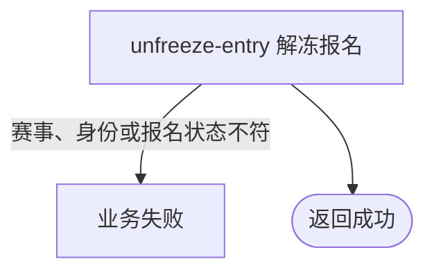

## 概要

让已绑定手机号的当前参赛者将本人冻结报名恢复为等待匹配。

## 触发

当前登录参赛者要将本人冻结报名恢复到原阶段、原轮次的匹配池时发起。

## 接口契约

请求体必须包含非空 `tournamentId`。成功返回标准无数据响应。

## 业务活动

- unfreeze-entry  校验本人解冻资格并将报名恢复为等待匹配

## 流程图

## 详细流程

1. 识别当前登录用户，接收非空赛事编号并取得赛事。
2. 确认赛事为 `ACTIVE`，且结束时间为空或当前时间未晚于结束时间。
3. 取得当前用户资料，确认用户存在且手机号非空。
4. 按赛事编号与当前用户取得报名，确认其为 `FROZEN`。
5. 将报名状态改为 `WAITING` 并在事务内保存，其他报名字段不变。

## 异常分支

| 对外失败码 | 触发条件 | 由哪个活动报出 | 补偿动作或超时处理 | 对外提示 |
|---|---|---|---|---|
| 未登录/参数校验错误 | 无有效登录用户，或赛事编号空白 | 入口鉴权与校验 | 不修改报名 | 统一登录提示／赛事ID不能为空 |
| `TOURNAMENT_NOT_FOUND` | 赛事不存在 | unfreeze-entry | 不修改报名 | 赛事不存在 |
| `TOURNAMENT_STATUS_ILLEGAL` | 赛事不是 `ACTIVE`，或当前时间晚于非空结束时间 | unfreeze-entry | 报名保持 `FROZEN` | 赛事当前状态不允许该操作 |
| 登录凭证无效 | 登录身份无对应用户 | unfreeze-entry | 不修改报名 | 登录凭证无效，请重新登录 |
| `USER_PHONE_REQUIRED` | 本人手机号空白 | unfreeze-entry | 报名保持 `FROZEN` | 请先绑定手机号 |
| `TOURNAMENT_ENTRY_NOT_FOUND` | 本人在该赛事无报名 | unfreeze-entry | 不创建报名 | 报名记录不存在 |
| `TOURNAMENT_ENTRY_STATUS_ILLEGAL` | 报名不是 `FROZEN` | unfreeze-entry | 保持原状态，重复解冻不幂等 | 报名当前状态不允许该操作 |
| `OPERATION_FAILED` | 读取或保存失败 | unfreeze-entry | 事务回滚，报名保持原状态 | 系统异常，请稍后重试 |

## 技术线索

- HTTP：`POST /tournament/entry/unfreeze`
- 请求：`TournamentEntryUnfreezeCmd`
- 调用：`TournamentEntryAppService.unfreeze()` → `TournamentEntryService.unfreeze()` → `TournamentPolicy.assertCanUnfreeze()` / `assertPhoneBound()` → `TournamentEntry.unfreeze()`
- 事务：应用服务 `@Transactional`
