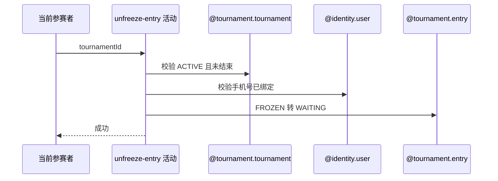

## 概要

校验赛事与本人资格，将冻结报名恢复到等待匹配。

## 时序图

## 触发条件

登录参赛者希望恢复本人 FROZEN 报名时执行。

## 活动契约

要求赛事 ACTIVE 且未过结束时间、用户存在并绑定手机号、报名精确 FROZEN；成功仅改为 WAITING，其他字段保留。

## 异常分支

| 错误标识 | 触发条件 | 处理 |
|---|---|---|
| `TOURNAMENT_NOT_FOUND`/`TOURNAMENT_STATUS_ILLEGAL` | 赛事缺失、非 ACTIVE 或已结束 | 保持 FROZEN |
| 登录凭证无效/`USER_PHONE_REQUIRED` | 用户缺失或手机号空白 | 保持 FROZEN |
| `TOURNAMENT_ENTRY_NOT_FOUND` | 本人无报名 | 不创建 |
| `TOURNAMENT_ENTRY_STATUS_ILLEGAL` | 报名不是 FROZEN | 保持原状态，重复调用不幂等 |
| `OPERATION_FAILED` | 读取或保存失败 | 事务回滚 |

## 领域依赖

### @tournament.tournament
- 输入：赛事编号与当前时间
- 输出：ACTIVE 且未结束结论
### @identity.user
- 输入：当前 userId
- 输出：账户与手机号绑定状态
### @tournament.entry
- 输入：本人 FROZEN 报名
- 输出：WAITING 报名

## 业务动作

A1 校验赛事仍可参与
A2 校验本人手机号
A3 校验 FROZEN 报名
A4 恢复 WAITING

## 详细流程

1. 取得赛事，要求 status=ACTIVE，且 endTime 为空或当前时间不晚于 endTime。
2. 读取当前用户，账户必须存在且 phone 非空白。
3. 按赛事和用户取得报名，仅 FROZEN 可继续；已 WAITING 的重复请求仍报状态非法。
4. 状态改 WAITING 并事务保存，原赛段、轮次、偏好和计数不变。

## 边界情况

- 当前时间恰等于 endTime 仍允许，晚于才拒绝。
- 解冻回原轮次匹配池，不重新报名或收费。
- 重复解冻不是幂等成功。

## 实现提示

写活动 `reads` 为空；跨赛事、身份与报名聚合做资格校验。
