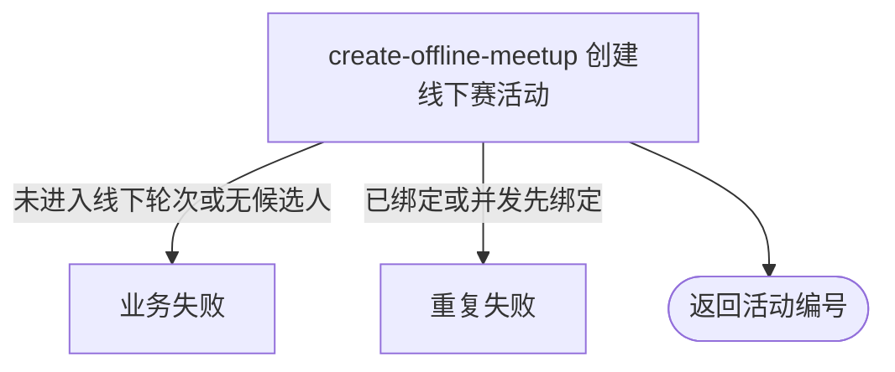

## 概要

为进入线下轮次的待匹配参赛者创建专属活动并绑定赛事。

## 触发

持有后台共享密钥的运营人员，在赛事当前轮次进入配置的线下承接轮次后发起。

## 接口契约

请求体提供赛事编号、创建人、开始时间、时长、场地地址、城市与坐标等活动资料，并遵守字段长度和经纬度校验。成功返回新活动业务编号。

## 业务活动

- create-offline-meetup  创建线下赛活动、批量加入成员并绑定赛事

## 流程图

## 详细流程

1. 运营提交赛事编号、活动创建人、时间与场地资料，取得指定赛事。
2. 确认赛事当前轮次等于线下承接轮次，且尚未绑定线下活动。
3. 选出该轮次中状态为 `WAITING` 的报名，按用户去重，并确认名单非空。
4. 将赛事 NTRP 转为精确等级条件，校验城市、时间、时长、场地与等级规则。
5. 创建 `TOURNAMENT` 类型、`OPEN` 状态、人数上限等于候选人数的活动，并将所有候选人直接保存为 `JOINED` 成员。
6. 以条件更新将活动编号绑定到赛事；若并发请求已先绑定则整体失败，成功时返回活动编号。

## 异常分支

| 对外失败码 | 触发条件 | 由哪个活动报出 | 补偿动作或超时处理 | 对外提示 |
|---|---|---|---|---|
| 无权限/参数校验错误 | 后台密钥无效，或必填活动资料缺失、超长、坐标越界 | 入口鉴权与校验 | 不创建 | 无权限访问／首个无效字段提示 |
| `TOURNAMENT_NOT_FOUND` | 赛事不存在 | create-offline-meetup | 不创建 | 赛事不存在 |
| `TOURNAMENT_STATUS_ILLEGAL` | 当前轮次不等于线下承接轮次 | create-offline-meetup | 不创建 | 赛事尚未进入线下赛阶段 |
| `DATA_DUPLICATE` | 赛事已有线下活动，或并发请求先绑定 | create-offline-meetup | 保留先绑定结果，回滚本次活动与成员 | 线下赛活动已创建 |
| `OPERATION_FAILED` | 线下轮次没有 `WAITING` 报名用户 | create-offline-meetup | 不创建 | 没有达到线下赛阶段的参赛者 |
| `TOURNAMENT_CONFIG_INCOMPLETE` | 赛事 NTRP 为空或非数值 | create-offline-meetup | 不创建 | 赛事 NTRP 等级不能为空／不是有效数值 |
| 约球规则错误 | 城市未开通、开始时间已过、时长或 NTRP 步长无效 | create-offline-meetup | 不创建 | 对应城市、时间、时长或水平规则提示 |
| `OPERATION_FAILED` | 活动、成员或赛事绑定保存失败 | create-offline-meetup | 事务回滚本次活动、成员和关联 | 系统异常，请稍后重试 |

## 技术线索

- HTTP：`POST /tournament/admin/offline/meetup/create`
- 请求：`TournamentOfflineMeetupCmd`；响应：活动 `String bizId`
- 调用：`TournamentAdminAppService.createOfflineMeetup()` → `TournamentOfflineMeetupService.create()` → `MeetupPolicy.assertTournamentOfflinePublish()` → `MeetupDomainService.saveTournamentOffline()` → `TournamentRepository.bindOfflineMeetupIfAbsent()`
- 事务：应用服务 `@Transactional`
