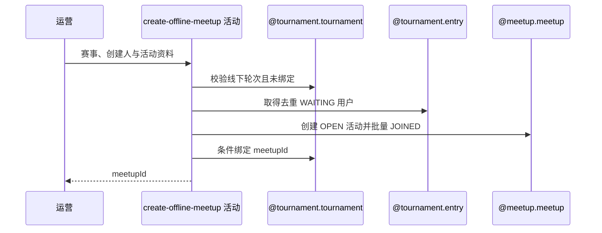

## 概要

创建线下赛活动、批量加入候选成员并唯一绑定赛事。

## 时序图

## 触发条件

后台运营在赛事当前轮次等于配置线下承接轮次时执行。

## 活动契约

从该轮 WAITING 报名提取非空去重用户，创建 TOURNAMENT/OPEN 专属活动并全部设 JOINED；仅当赛事尚未绑定时条件写入 meetupId。

## 异常分支

| 错误标识 | 触发条件 | 处理 |
|---|---|---|
| `TOURNAMENT_NOT_FOUND`/`TOURNAMENT_STATUS_ILLEGAL` | 赛事缺失或轮次未到 | 不创建 |
| `DATA_DUPLICATE` | 已绑定或并发先绑定 | 保留先结果，回滚本次活动成员 |
| `OPERATION_FAILED` | 无 WAITING 用户或保存失败 | 不创建/整体回滚 |
| `TOURNAMENT_CONFIG_INCOMPLETE`/约球规则错误 | NTRP、城市、时间、时长等无效 | 不创建 |

## 领域依赖

### @tournament.tournament
- 输入：赛事当前轮次、线下轮次与已有关联
- 输出：条件绑定 meetupId
### @tournament.entry
- 输入：赛事当前轮次
- 输出：WAITING 报名用户集合
### @meetup.meetup
- 输入：运营资料、精确 NTRP 与候选用户
- 输出：TOURNAMENT/OPEN 活动及 JOINED 成员

## 业务动作

A1 校验线下轮次与唯一关联
A2 筛选去重候选成员
A3 校验并构造线下活动
A4 批量加入成员
A5 条件绑定赛事

## 详细流程

1. 取得赛事，要求 currentRound=offlineRound 且 offlineMeetupId 为空。
2. 筛选该轮 WAITING 报名，按 userId 去重；空名单报无达标参赛者。
3. 将赛事 NTRP 解析为精确等级，校验城市已开通、未来开始时间、时长、场地和等级步长。
4. 创建 type=TOURNAMENT、status=OPEN、人数上限=候选数的活动，所有候选直接保存 JOINED。
5. 以“关联仍为空”为条件绑定 meetupId；并发失败抛重复，活动、成员、绑定同事务回滚。

## 边界情况

- 创建人不必来自候选 WAITING 名单，按请求指定。
- 候选按用户去重，双打同一用户不会重复加入。
- 并发只允许一个活动最终绑定赛事。

## 实现提示

写活动 `reads` 为空；复用 `@meetup.meetup` 聚合与赛事条件更新。
