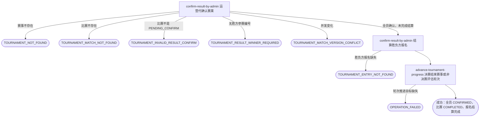

## 概要

让运营在赛果迟迟等不到全员确认时，按赛事和比赛序号一次性代确认并完成比赛结算。

## 触发

后台运营按赛事编号和比赛序号，对一场卡在待确认赛果的比赛发起代确认；比赛已全部确认时重复请求按幂等处理。

## 接口契约

### 请求参数

| 字段 | 类型 | 必填 | 约束 |
|---|---|---|---|
| `tournamentId` | String | 是 | 非空，必须对应已存在赛事。 |
| `matchNo` | Integer | 是 | 正整数，与 `tournamentId` 共同唯一定位比赛。 |

### 成功响应

无

## 业务活动

- confirm-result-by-admin  按赛事和比赛序号锁定比赛，将全部仍待确认的参与者一次性改为已确认，全员确认后完成比赛并结算胜负方报名
- advance-tournament-progress  非决赛时评估赛事当前轮次是否可推进；决赛时结束赛事并记录冠军

## 流程图

## 详细流程

1. 接收并校验赛事编号和正整数比赛序号，确认赛事存在。
2. 按赛事编号和比赛序号取得最新比赛及全部参与者；比赛不存在时拒绝。
3. 确认比赛正处于待确认赛果且已记录胜方参赛编号；不满足则拒绝，不修改任何对象。
4. 将本场比赛所有仍待确认的参与者赛果确认状态一次性改为已确认并记录确认时间；已被拒绝或已经是已确认的参与者保持原状。
5. 全部参与者确认状态凑齐为已确认后，将比赛置为已完成并记录完成时间；仍有参与者停留在已被拒绝时，比赛保持待确认赛果，不做结算，本次代确认仍按成功返回。
6. 完成比赛后按胜方参赛编号结算：资格赛胜方进入待支付，资格赛负方回到等待匹配；非决赛正赛胜方进入下一轮等待匹配，正赛负方被淘汰。
7. 已完成比赛的轮次是决赛时，胜方报名成为冠军，赛事进入已结束并写入冠军参赛编号和比赛完成时间。
8. 非决赛时，按赛事各轮完成情况评估当前轮次是否满足推进条件，满足才向后推进，不会倒退。
9. 比赛完成、报名结算与赛事轮次推进在同一事务内完成；成功后返回无数据响应，不发送通知。

## 异常分支

| 对外失败码 | 触发条件 | 由哪个活动报出 | 补偿动作或超时处理 | 对外提示 |
|---|---|---|---|---|
| 无权限/参数校验错误 | 运营访问无效、`tournamentId` 空白或 `matchNo` 不是正整数 | 流程 | 不读取或修改 | 无权限访问／赛事ID不能为空／比赛序号必须为正整数 |
| `TOURNAMENT_NOT_FOUND` | 指定赛事不存在 | confirm-result-by-admin | 不修改比赛、参与者和报名 | 赛事不存在 |
| `TOURNAMENT_MATCH_NOT_FOUND` | 指定赛事下不存在该比赛序号 | confirm-result-by-admin | 不补建或修改任何对象 | 比赛不存在 |
| `TOURNAMENT_INVALID_RESULT_CONFIRM` | 比赛不是 `PENDING_CONFIRM`（例如仍在待比赛、已终止或已完成） | confirm-result-by-admin | 比赛、参与者、报名和赛事轮次均保持原状 | 当前状态不允许确认结果 |
| `TOURNAMENT_RESULT_WINNER_REQUIRED` | 比赛为 `PENDING_CONFIRM` 但没有已记录的胜方参赛编号 | confirm-result-by-admin | 不修改任何赛事数据 | 请选择获胜方 |
| `TOURNAMENT_ENTRY_NOT_FOUND` | 全员确认后，任一胜方或负方参与者没有对应赛事报名 | confirm-result-by-admin | 事务回滚，不交付部分完成结果 | 报名记录不存在 |
| 无（按成功返回） | 代确认后仍有参与者停留在已被拒绝，未能凑齐全部已确认 | confirm-result-by-admin | 比赛保持待确认赛果，不结算报名、不推进轮次；待该参与者的拒绝被其他方式处理后可再次代确认 | 代确认成功 |
| `TOURNAMENT_MATCH_VERSION_CONFLICT` | 保存前比赛已被并发修改 | confirm-result-by-admin | 事务回滚，保留先完成的变化 | 比赛状态已变更，请刷新后重试 |
| `OPERATION_FAILED` | 比赛、参与关系、报名、赛事轮次或冠军结算的本次变化未能完整保存，或轮次推进目标缺失 | confirm-result-by-admin / advance-tournament-progress | 事务回滚，不交付部分代确认结果 | 系统异常，请稍后重试 |

## 技术线索

- 新入口：`POST /tournament/admin/match/result/confirm`
- 请求字段：`tournamentId`、`matchNo`
- 幂等：目标比赛已是 `COMPLETED` 或参与者已全部 `CONFIRMED` 时按幂等处理，不重复改写确认时间、不重复结算报名或推进轮次
- 不新增操作人字段，不区分运营代确认与参赛者本人确认
- 仅处理仍为 `PENDING` 的参与者，已被记为 `REJECTED` 的参与者保持原状不覆盖
