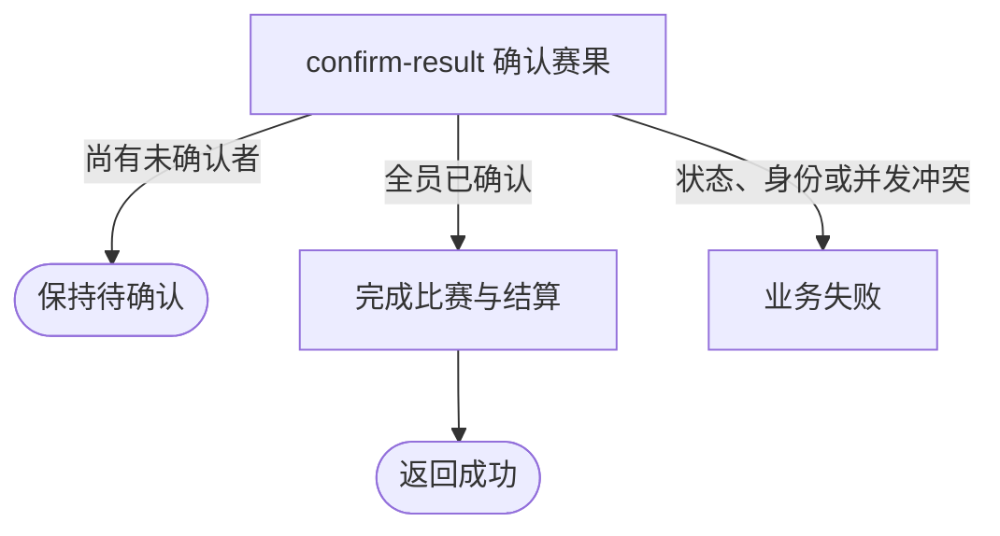

## 概要

记录当前参赛者接受已提交赛果，并在全员确认后完成比赛与胜负结算。

## 触发

已提交赛果的比赛参与者要接受当前胜方结论时，以 `confirm=true` 发起。

## 接口契约

请求体必须含非空 `matchId` 和非空 `confirm`，本流程要求 `confirm=true`；`acceptedNoticeScenes` 可选。成功返回无数据响应。

## 业务活动

- confirm-result  记录本人确认，并在全员确认时完成比赛与晋级结算

## 流程图

## 详细流程

1. 识别当前登录用户，接收非空比赛编号、`confirm=true` 和已授权通知场景。
2. 取得比赛及参与者，确认比赛为 `PENDING_CONFIRM`，所属赛事、本人报名和本人参与关系存在。
3. 将本人赛果确认状态设为 `CONFIRMED` 并记录当前时间；若尚有未确认者，保存后结束。
4. 若全员已确认，确认胜方参赛编号存在，将比赛改为 `COMPLETED` 并记录完成时间。
5. 结算胜负方报名：资格赛胜方进入 `PAYING`、负方回 `WAITING`；正赛胜方回 `WAITING` 并在非决赛时晋级，负方进入 `ELIMINATED`。
6. 按已完成场数评估是否推进赛事轮次，事务保存后登记有效赛事通知授权并返回成功。

## 异常分支

| 对外失败码 | 触发条件 | 由哪个活动报出 | 补偿动作或超时处理 | 对外提示 |
|---|---|---|---|---|
| 未登录/参数校验错误 | 无有效登录，比赛编号空白，或 `confirm` 未提供 | 入口鉴权与校验 | 不修改 | 统一登录提示／比赛ID不能为空／确认状态不能为空 |
| `TOURNAMENT_ENTRY_NOT_FOUND` | 比赛不存在、本人报名不存在，或本人不属于参与者 | confirm-result | 事务回滚 | 报名记录不存在 |
| `TOURNAMENT_NOT_FOUND` | 比赛所属赛事不存在 | confirm-result | 事务回滚 | 赛事不存在 |
| `TOURNAMENT_INVALID_RESULT_CONFIRM` | 比赛不是 `PENDING_CONFIRM` | confirm-result | 所有对象不变 | 当前状态不允许确认结果 |
| `TOURNAMENT_RESULT_WINNER_REQUIRED` | 全员确认时没有胜方参赛编号 | confirm-result | 事务回滚本次确认 | 请选择获胜方 |
| `TOURNAMENT_MATCH_VERSION_CONFLICT` | 保存前比赛已被并发修改 | confirm-result | 事务回滚，保留先完成的变化 | 比赛状态已变更，请刷新后重试 |
| `OPERATION_FAILED` | 参与关系、报名、比赛或赛事轮次保存失败 | confirm-result | 事务回滚，不交付部分结果 | 系统异常，请稍后重试 |
| 无对外失败 | 授权场景重复、非赛事场景，或通知额度登记异常 | confirm-result | 过滤去重或记录日志，不影响赛果主流程 | 确认成功 |

## 技术线索

- HTTP：`POST /tournament/match/result-confirm`
- 请求：`ResultConfirmCmd`，本流程仅 `confirm=true`
- 调用：`TournamentMatchAppService.confirmResult()` → `TournamentMatchFlowService.handleResultConfirm()` → `TournamentMatch.confirmResult()` → `TournamentRoundProgressService.advanceIfReady()`
- 并发：`TournamentMatchRepository.updateWithVersion()`
- 事务：应用与领域方法均 `@Transactional(rollbackFor = Exception.class)`；通知额度登记内部吞异常
