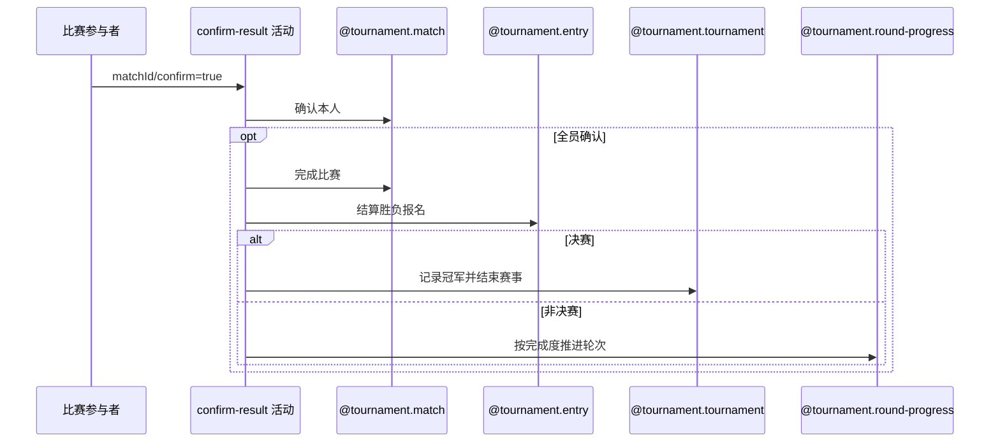

## 概要

确认赛果，并在全员确认时完成比赛；普通轮次结算报名与轮次，决赛结算冠军与赛事终态。

## 时序图

## 触发条件

PENDING_CONFIRM 比赛参与者提交 `confirm=true` 时执行。

## 活动契约

本人转 CONFIRMED；未全员确认时保持待确认。全员确认须有胜方，比赛转 COMPLETED；非决赛按资格赛/正赛结算报名和评估轮次，决赛胜方成为冠军且赛事结束。

## 异常分支

| 错误标识 | 触发条件 | 处理 |
|---|---|---|
| `TOURNAMENT_ENTRY_NOT_FOUND`/`TOURNAMENT_NOT_FOUND` | 比赛、本人报名/参与关系或赛事缺失 | 回滚 |
| `TOURNAMENT_INVALID_RESULT_CONFIRM` | 比赛非 PENDING_CONFIRM | 不修改 |
| `TOURNAMENT_RESULT_WINNER_REQUIRED` | 全员确认但无胜方 | 本次确认也回滚 |
| `TOURNAMENT_MATCH_VERSION_CONFLICT`/`OPERATION_FAILED` | 并发或结算保存失败 | 整体回滚 |

## 领域依赖

### @tournament.match
- 输入：待确认比赛、本人参与关系与版本
- 输出：确认状态及按需 COMPLETED
### @tournament.entry
- 输入：胜负方报名及赛段
- 输出：PAYING/WAITING/ELIMINATED/CHAMPION 与晋级
### @tournament.tournament
- 输入：已完成决赛、胜方报名编号和完成时间
- 输出：FINISHED、championEntryNo 和 endTime
### @tournament.round-progress
- 输入：赛事轮次、完成场数和锁位情况
- 输出：按需推进当前轮次

## 业务动作

A1 校验待确认与参与身份
A2 确认本人赛果
A3 全员时完成比赛
A4 结算胜负报名
A5 决赛结束赛事或评估普通轮次推进

## 详细流程

1. 要求比赛 PENDING_CONFIRM，赛事、本人报名及参与关系存在；本人改 CONFIRMED 并记录当前时间。
2. 尚有未确认者时保存后结束；全员确认时 winnerEntryNo 必须存在，比赛转 COMPLETED 并记完成时间。
3. 资格赛胜方转 PAYING、负方 WAITING；非决赛正赛胜方转 WAITING 并晋级，负方 ELIMINATED；决赛胜方转 CHAMPION，负方 ELIMINATED。
4. 比赛轮次为 FINAL 时，以 winnerEntryNo 和 completedTime 将赛事更新为 FINISHED，并记录 championEntryNo、endTime；否则根据已完成场数和正赛锁位评估是否推进赛事 currentRound。

## 边界情况

- 重复确认仅在比赛仍 PENDING_CONFIRM 时可执行并刷新时间。
- 缺胜方会回滚触发全员确认的本次操作。
- 资格赛胜方不是立即 WAITING，而先 PAYING。
- 决赛完成判断使用已完成比赛自身的 round=FINAL，不以赛事 currentRound 单独代替决赛完成事实。

## 实现提示

写活动 `reads` 为空；轮次推进注册为领域服务，本阶段不设计。
