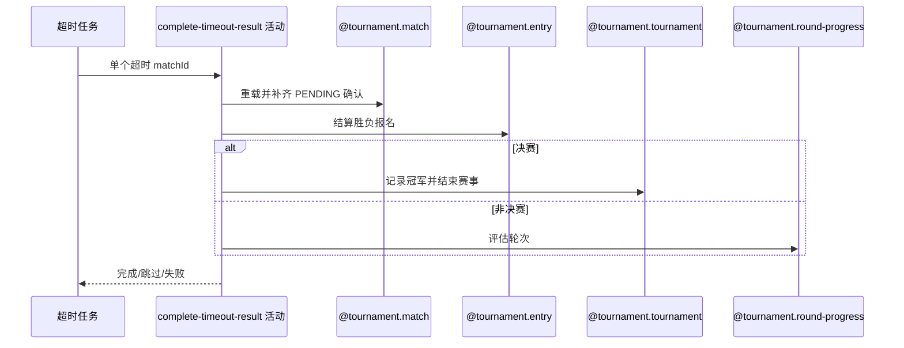

## 概要

自动确认单场超时赛果；普通轮次完成报名与轮次结算，决赛完成冠军与赛事终态结算。

## 时序图

## 触发条件

任务扫描到 PENDING_CONFIRM 且 submittedTime 不晚于当前减 48 小时的单场候选时执行。

## 活动契约

逐场重载，状态已变则跳过；把仍 PENDING 的参与确认设 CONFIRMED，保留其他状态，要求胜方并完成比赛。非决赛结算报名和轮次，决赛产生冠军并结束赛事。

## 异常分支

| 错误标识 | 触发条件 | 处理 |
|---|---|---|
| 跳过 | 重载后非 PENDING_CONFIRM | 不修改，继续下一场 |
| `TOURNAMENT_ENTRY_NOT_FOUND`/`TOURNAMENT_NOT_FOUND` | 比赛、参与报名或赛事缺失 | 本场回滚，继续 |
| `TOURNAMENT_RESULT_WINNER_REQUIRED` | 缺胜方编号 | 本场回滚，继续 |
| `TOURNAMENT_MATCH_VERSION_CONFLICT`/`OPERATION_FAILED` | 并发或保存失败 | 本场回滚，不影响其他场 |

## 领域依赖

### @tournament.match
- 输入：超时待确认比赛与版本
- 输出：补齐确认并 COMPLETED
### @tournament.entry
- 输入：胜负方报名与赛段
- 输出：资格赛/正赛结算，决赛胜方 CHAMPION
### @tournament.tournament
- 输入：已完成决赛、胜方报名编号和完成时间
- 输出：FINISHED、championEntryNo 和 endTime
### @tournament.round-progress
- 输入：比赛完成后的赛事状态
- 输出：按需推进轮次

## 业务动作

A1 重载并幂等复核
A2 自动补齐待确认参与者
A3 完成比赛并结算报名
A4 决赛结束赛事或评估普通轮次

## 详细流程

1. 外层按固定 48 小时扫描；活动逐场重载，非 PENDING_CONFIRM 幂等跳过。
2. 仅把 resultConfirmation=PENDING 的参与者改 CONFIRMED 并写统一时间，原 CONFIRMED/REJECTED 等状态保留。
3. 要求 winnerEntryNo，比赛转 COMPLETED；资格赛胜方 PAYING/负方 WAITING，非决赛正赛胜方 WAITING 并晋级、负方 ELIMINATED，决赛胜方 CHAMPION、负方 ELIMINATED。
4. 比赛 round=FINAL 时记录 championEntryNo、endTime 并将赛事置 FINISHED，否则评估赛事轮次；比赛版本更新及参与关系、报名、赛事同一单场事务。
5. 外层按场捕获异常继续其他候选。

## 边界情况

- 自动完成不会覆盖已存在的非 PENDING 确认状态。
- 缺胜方的超时比赛无法自动修复，会持续在后续轮次失败。
- 每场隔离，已成功场次不因其他失败回滚。
- 决赛完成判断使用比赛自身的 round=FINAL；赛事 currentRound=FINAL 本身不代表决赛已经完成。

## 实现提示

写活动 `reads` 为空；超时阈值固定 48 小时。
