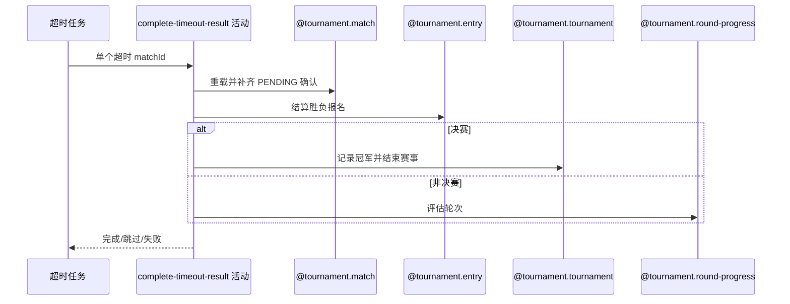

## 概要

自动确认单场超时赛果，并结算报名、轮次、冠军与赛事终态。

## 时序图

## 触发条件

任务扫描到 PENDING_CONFIRM 且 submittedTime 不晚于当前减 48 小时的单场候选时执行。

## 活动契约

### 入参

| 字段 | 类型 | 必填 | 约束 |
|---|---|---|---|
| `matchId` | 字符串 | 是 | 外层按固定 48 小时阈值筛出的单场候选 |
| `completedTime` | 日期时间 | 是 | 本场统一自动确认与完成时间 |

### 成功返回

| 字段 | 类型 | 必填 | 说明 |
|---|---|---|---|
| 无 | - | - | 状态已变化时跳过，完成结算时也不返回数据 |

## 异常分支

| 错误标识 | 触发条件 | 来源 |
|---|---|---|
| 跳过 | 重载后非 `PENDING_CONFIRM` | complete-timeout-results 流程的状态已变一行 |
| `TOURNAMENT_ENTRY_NOT_FOUND` | 比赛或参与报名缺失 | complete-timeout-results 流程同名错误一行 |
| `TOURNAMENT_NOT_FOUND` | 所属赛事缺失 | complete-timeout-results 流程同名错误一行 |
| `TOURNAMENT_RESULT_WINNER_REQUIRED` | 缺胜方编号 | complete-timeout-results 流程同名错误一行 |
| `TOURNAMENT_MATCH_VERSION_CONFLICT` | 保存前比赛已被并发修改 | complete-timeout-results 流程同名错误一行 |
| `OPERATION_FAILED` | 本场参与关系、报名、比赛、赛事或轮次保存失败 | complete-timeout-results 流程同名错误一行 |

## 领域依赖

### @tournament.match

- 输入：超时待确认比赛与版本
- 输出：补齐确认并 COMPLETED

### @tournament.entry

- 输入：胜负方报名与赛段
- 输出：资格赛/正赛结算，决赛胜方 CHAMPION

### @tournament.tournament

- 输入：已完成决赛、胜方报名编号和完成时间
- 输出：FINISHED、championEntryNo 和 endTime

### @tournament.round-progress

- 输入：比赛完成后的赛事状态
- 输出：按需推进轮次

## 业务动作

- A1 重载并幂等复核。
- A2 自动补齐待确认参与者。
- A3 完成比赛并结算报名。
- A4 决赛结束赛事或评估普通轮次。

## 详细流程

1. A1 外层按固定 48 小时扫描；活动逐场重载，非 `PENDING_CONFIRM` 幂等跳过。
2. A2 仅把 `resultConfirmation=PENDING` 的参与者改为 `CONFIRMED` 并写统一时间，原 `CONFIRMED/REJECTED` 等状态保留。
3. A3 要求 `winnerEntryNo`，比赛转 `COMPLETED`；资格赛胜方 `PAYING`、负方 `WAITING`，非决赛正赛胜方 `WAITING` 并晋级、负方 `ELIMINATED`，决赛胜方 `CHAMPION`、负方 `ELIMINATED`。
4. A4 比赛 `round=FINAL` 时记录 `championEntryNo`、`endTime` 并将赛事置 `FINISHED`，否则评估赛事轮次；比赛版本更新及参与关系、报名、赛事同一单场事务。
5. A4 外层按场捕获异常并继续其他候选，已成功场次不回滚。

## 边界情况

- 自动完成不会覆盖已存在的非 PENDING 确认状态。
- 缺胜方的超时比赛无法自动修复，会持续在后续轮次失败。
- 每场隔离，已成功场次不因其他失败回滚。
- 决赛完成判断使用比赛自身的 round=FINAL；赛事 currentRound=FINAL 本身不代表决赛已经完成。

## 实现提示

写活动 `reads` 为空；超时阈值固定 48 小时。
