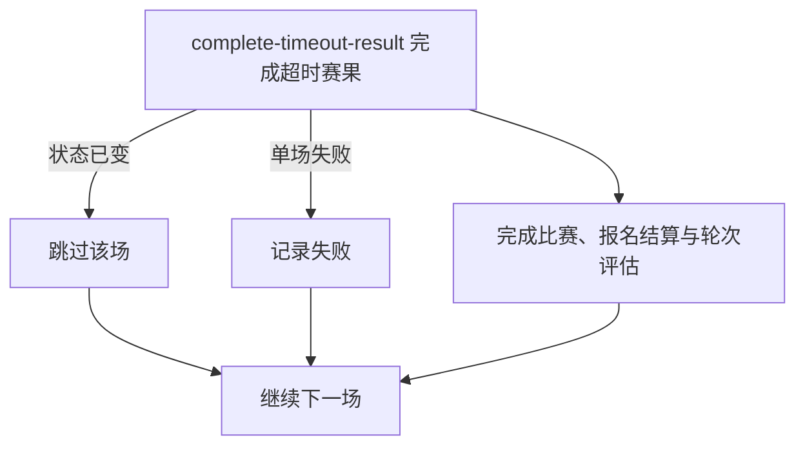

## 概要

定时批量完成提交后超过 48 小时仍待确认的赛果，结算报名并评估轮次。

## 触发

`job.tournamentMatchTimeout.enabled=true` 时加载任务，按配置表达式触发；默认每两小时执行一次。

## 接口契约

无同步入参和用户响应。每轮处理赛果提交时间不晚于当前时间减 48 小时的 `PENDING_CONFIRM` 比赛。

## 业务活动

- complete-timeout-result  自动确认单场超时赛果并完成结算

## 流程图

## 详细流程

1. 开启赛事超时任务时，按配置 cron 执行，扫描 `PENDING_CONFIRM` 且 `submittedTime` 不晚于当前时间减 48 小时的比赛。
2. 逐场重新加载比赛与参与者；已不是 `PENDING_CONFIRM` 时幂等跳过。
3. 将仍为 `PENDING` 的赛果确认改为 `CONFIRMED` 并写入统一时间，保留其他确认状态；将比赛改为 `COMPLETED`。
4. 按已提交胜方参赛编号结算每位参与者报名：资格赛胜方 `PAYING`、负方 `WAITING`；正赛胜方 `WAITING` 并可晋级，负方 `ELIMINATED`。
5. 按已完成场数和正赛锁位情况评估赛事轮次，每场在独立事务中提交。
6. 某场失败时记录日志并继续处理同批其他比赛。

## 异常分支

| 对外失败码 | 触发条件 | 由哪个活动报出 | 补偿动作或超时处理 | 对外提示 |
|---|---|---|---|---|
| 无 | 本轮无符合条件的比赛 | 批量扫描 | 无变更，正常结束 | 无 |
| 无 | 逐场处理时已不是 `PENDING_CONFIRM` | complete-timeout-result | 幂等跳过，保留最新状态 | 无 |
| `TOURNAMENT_ENTRY_NOT_FOUND` | 比赛已不存在，或任一参与者无对应报名 | complete-timeout-result | 该场事务回滚，记日志后继续其他场 | 无 |
| `TOURNAMENT_RESULT_WINNER_REQUIRED` | 比赛缺少胜方参赛编号 | complete-timeout-result | 该场事务回滚，继续其他场 | 无 |
| `TOURNAMENT_NOT_FOUND` | 所属赛事不存在 | complete-timeout-result | 该场事务回滚，继续其他场 | 无 |
| `TOURNAMENT_MATCH_VERSION_CONFLICT` | 保存前比赛被并发修改 | complete-timeout-result | 不覆盖先变化，该场回滚并继续 | 无 |
| `OPERATION_FAILED` | 比赛、参与关系、报名或赛事轮次未完整保存 | complete-timeout-result | 该场事务回滚，不影响其他已完成场次 | 无 |

## 技术线索

- Job：`TournamentMatchTimeoutJob.processTimeoutMatches()` 中的 `processPendingConfirmTimeout()`
- 开关：`job.tournamentMatchTimeout.enabled=true`
- 调度：`${job.tournamentMatchTimeout.cron:0 0 */2 * * ?}`
- 调用：`TournamentMatchRepository.findTimeoutMatches(PENDING_CONFIRM, now-48h)` → `TournamentMatchFlowService.completePendingConfirmTimeout()` → `TournamentRoundProgressService.advanceIfReady()`
- 事务：每场 `@Transactional(rollbackFor = Exception.class)`；Job 按场 `try/catch`
