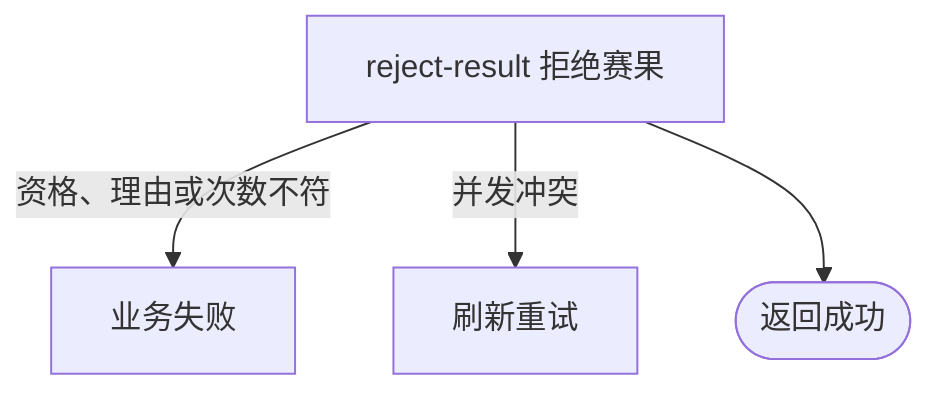

## 概要

让比赛参与者拒绝待确认赛果，终止比赛、累计拒绝次数并让有效报名回池。

## 触发

待确认赛果的比赛参与者不接受当前胜方结论时，以 `confirm=false` 和有效理由发起。

## 接口契约

请求体包含非空 `matchId`、`confirm=false` 和有效 `rejectReason`；后端不接收订阅相关字段。

## 业务活动

- reject-result  拒绝赛果、终止比赛并结算拒绝后回池

## 流程图

## 详细流程

1. 识别当前登录用户，接收比赛编号、`confirm=false` 和拒绝理由。
2. 取得比赛及参与者，确认比赛为 `PENDING_CONFIRM`，赛事、本人报名和本人参与关系存在。
3. 按本人报名阶段选择资格赛或正赛拒绝上限，确认当前累计值未达上限，且拒绝理由有效。
4. 将本人赛果确认改为 `REJECTED`、记录时间，将比赛改为 `REJECTED` 并保存理由，同时使本人当前阶段拒绝次数加一。
5. 关闭仍为 `DRAFT` 的关联赛约，将同场参与者中仍为 `IN_MATCH` 的报名改回 `WAITING`，事务性保存。
6. 事务提交后，以 `TOURNAMENT_REJECTED:matchId` 事件向除拒绝人外的参与者直接尝试通知，并记录触达结果。

## 异常分支

| 对外失败码 | 触发条件 | 由哪个活动报出 | 补偿动作或超时处理 | 对外提示 |
|---|---|---|---|---|
| 未登录/参数校验错误 | 无有效登录，比赛编号空白，或 `confirm` 缺失 | 入口鉴权与校验 | 不修改 | 统一登录提示／比赛ID不能为空／确认状态不能为空 |
| `TOURNAMENT_INVALID_REJECT_REASON` | `confirm=false` 但未提供有效赛果拒绝理由 | reject-result | 事务回滚 | 无效的拒绝理由 |
| `TOURNAMENT_ENTRY_NOT_FOUND` | 比赛、本人报名、本人参与关系或某参与者报名不存在 | reject-result | 事务回滚所有本次变化 | 报名记录不存在 |
| `TOURNAMENT_NOT_FOUND` | 所属赛事不存在 | reject-result | 事务回滚 | 赛事不存在 |
| `TOURNAMENT_INVALID_RESULT_CONFIRM` | 比赛不是 `PENDING_CONFIRM` | reject-result | 所有对象不变 | 当前状态不允许确认结果 |
| `TOURNAMENT_REJECT_LIMIT_REACHED` | 本人当前阶段拒绝次数已达上限 | reject-result | 不增加次数，不终止比赛 | 已达拒绝次数上限 |
| `TOURNAMENT_MATCH_VERSION_CONFLICT` | 比赛已被并发修改 | reject-result | 事务回滚，保留先保存结果 | 比赛状态已变更，请刷新后重试 |
| 无对外失败 | 关联赛约不存在/非 `DRAFT`，参与者报名非 `IN_MATCH`，或通知不可触达/发送失败 | reject-result | 不修改不符状态的对象；通知结果写触达日志后容错 | 拒绝成功 |
| `OPERATION_FAILED` | 比赛、参与关系、拒绝次数、报名或草稿赛约未完整保存 | reject-result | 事务回滚，不交付部分结果 | 系统异常，请稍后重试 |

## 技术线索

- HTTP：`POST /tournament/match/result-confirm`
- 请求：`ResultConfirmCmd`，本流程仅 `confirm=false`
- 调用：`TournamentMatchAppService.confirmResult()` → `TournamentMatchFlowService.handleResultConfirm()` → `TournamentMatch.confirmResult()` → `settleRejectedMatch()`
- 并发：`TournamentMatchRepository.updateWithVersion()`
- 事务：`@Transactional(rollbackFor = Exception.class)`；通知在提交后异步发送，不影响拒绝主事务
