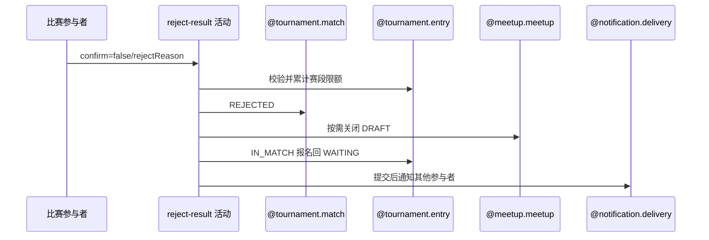

## 概要

拒绝待确认赛果、累计赛段次数并让有效报名回池。

## 时序图

## 触发条件

PENDING_CONFIRM 比赛参与者提交 `confirm=false` 和有效拒绝理由时执行。

## 活动契约

### 入参

| 字段 | 类型 | 必填 | 约束 |
|---|---|---|---|
| `matchId` | 字符串 | 是 | 目标待确认比赛编号 |
| `confirm` | 布尔 | 是 | 本活动固定为 `false` |
| `rejectReason` | 枚举 | 是 | 须为接口支持的有效赛果拒绝理由 |
| `operatorId` | 字符串 | 是 | 须存在本人报名与比赛参与关系 |
| `rejectedTime` | 日期时间 | 是 | 记录本人拒绝时间 |

### 成功返回

| 字段 | 类型 | 必填 | 说明 |
|---|---|---|---|
| 无 | - | - | 拒赛主事务完成后不返回数据；通知结果不随接口返回 |

## 异常分支

| 错误标识 | 触发条件 | 来源 |
|---|---|---|
| `TOURNAMENT_INVALID_REJECT_REASON` | `confirm=false` 但理由无效 | reject-result 流程同名错误一行 |
| `TOURNAMENT_ENTRY_NOT_FOUND` | 比赛、本人报名、本人参与关系或某参与者报名缺失 | reject-result 流程同名错误一行 |
| `TOURNAMENT_NOT_FOUND` | 所属赛事缺失 | reject-result 流程同名错误一行 |
| `TOURNAMENT_INVALID_RESULT_CONFIRM` | 比赛非 `PENDING_CONFIRM` | reject-result 流程同名错误一行 |
| `TOURNAMENT_REJECT_LIMIT_REACHED` | 本人当前赛段达到拒绝上限 | reject-result 流程同名错误一行 |
| `TOURNAMENT_MATCH_VERSION_CONFLICT` | 保存前比赛已被并发修改 | reject-result 流程同名错误一行 |
| `OPERATION_FAILED` | 比赛、参与关系、计数、报名或草稿赛约保存失败 | reject-result 流程同名错误一行 |

## 领域依赖

### @tournament.match

- 输入：待确认比赛、本人理由与版本
- 输出：REJECTED 比赛及本人确认

### @tournament.entry

- 输入：本人赛段计数和全体报名
- 输出：次数+1，IN_MATCH 回 WAITING

### @meetup.meetup

- 输入：关联赛约
- 输出：仅 DRAFT 时关闭

### @notification.delivery

- 输入：`TOURNAMENT_REJECTED:matchId` 事件、其他参与者和拒绝通知内容
- 输出：按接收人与渠道去重后直接尝试发送，记录 `SENT/FAILED/SKIPPED`

## 业务动作

- A1 校验参与资格和拒绝理由。
- A2 校验并累计赛段限额。
- A3 拒绝比赛与本人确认。
- A4 关闭草稿赛约并释放报名。
- A5 提交后通知其他参与者。

## 详细流程

1. A1 要求比赛 `PENDING_CONFIRM`、本人报名/参与关系和赛事存在，`rejectReason` 有效。
2. A2 依本人资格赛/正赛阶段选择对应 `rejectLimit`，达到即拒绝；通过后只将对应阶段计数加一。
3. A3 本人确认改为 `REJECTED` 并记时间，比赛改为 `REJECTED` 并保存理由。
4. A4 仅关闭 `DRAFT` 关联赛约；全体参与者报名中仅 `IN_MATCH` 改为 `WAITING`，任一报名缺失整体失败。
5. A5 提交后排除拒绝人，向其他参与者直接尝试拒绝通知；触达日志唯一键阻止同事件、同接收人和同渠道重发。

## 边界情况

- 赛约缺失/非 DRAFT 或报名已非 IN_MATCH 不阻止拒赛。
- 资格赛与正赛拒绝次数分开累计。
- 通知失败不回滚拒绝主事务。

## 实现提示

写活动 `reads` 为空；拒赛结算不推进赛事轮次。
