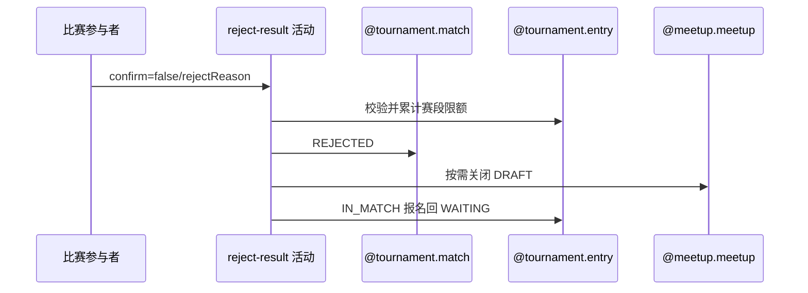

## 概要

拒绝待确认赛果、累计赛段次数并让有效报名回池。

## 时序图

## 触发条件

PENDING_CONFIRM 比赛参与者提交 `confirm=false` 和有效拒绝理由时执行。

## 活动契约

在本人当前赛段拒绝上限内，把本人确认和比赛改 REJECTED、次数加一；仅关闭 DRAFT 赛约，并让 IN_MATCH 报名回 WAITING。

## 异常分支

| 错误标识 | 触发条件 | 处理 |
|---|---|---|
| `TOURNAMENT_INVALID_REJECT_REASON` | confirm=false 但理由无效 | 回滚 |
| `TOURNAMENT_ENTRY_NOT_FOUND`/`TOURNAMENT_NOT_FOUND` | 比赛、报名、参与关系或赛事缺失 | 整体回滚 |
| `TOURNAMENT_INVALID_RESULT_CONFIRM` | 比赛非 PENDING_CONFIRM | 不修改 |
| `TOURNAMENT_REJECT_LIMIT_REACHED` | 本人当前赛段达上限 | 不加次数、不拒绝 |
| `TOURNAMENT_MATCH_VERSION_CONFLICT`/`OPERATION_FAILED` | 并发或保存失败 | 整体回滚 |

## 领域依赖

### @tournament.match
- 输入：待确认比赛、本人理由与版本
- 输出：REJECTED 比赛及本人确认
### @tournament.entry
- 输入：本人赛段计数和全体报名
- 输出：次数+1，IN_MATCH 回 WAITING
### @meetup.meetup
- 输入：关联赛约
- 输出：仅 DRAFT 时关闭
### @notification.delivery
- 输入：`TOURNAMENT_REJECTED:matchId` 事件、其他参与者和拒绝通知内容
- 输出：按接收人与渠道去重后直接尝试发送，记录 `SENT/FAILED/SKIPPED`

## 业务动作

A1 校验参与资格和拒绝理由
A2 校验并累计赛段限额
A3 拒绝比赛与本人确认
A4 关闭草稿赛约并释放报名
A5 提交后通知

## 详细流程

1. 要求比赛 PENDING_CONFIRM、本人报名/参与关系和赛事存在，rejectReason 有效。
2. 依本人资格赛/正赛阶段选对应 rejectLimit，达到即拒绝；通过后对应计数加一。
3. 本人确认改 REJECTED 并记时间，比赛改 REJECTED 并保存理由。
4. 仅关闭 DRAFT 关联赛约；全体参与者报名中仅 IN_MATCH 改 WAITING，任一报名缺失整体失败。
5. 提交后向其他参与者直接尝试拒绝通知；触达日志唯一键阻止同事件、同接收人和同渠道重发。

## 边界情况

- 赛约缺失/非 DRAFT 或报名已非 IN_MATCH 不阻止拒赛。
- 资格赛与正赛拒绝次数分开累计。
- 通知失败不回滚拒绝主事务。

## 实现提示

写活动 `reads` 为空；拒赛结算不推进赛事轮次。
