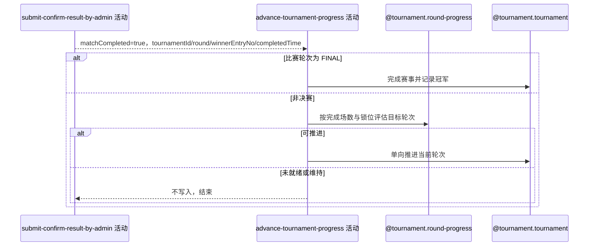

## 概要

决赛完成时结束赛事并记录冠军；非决赛时按完赛进度评估并推进赛事当前轮次。

## 时序图

## 触发条件

`submit-confirm-result-by-admin` 完成本场比赛结算且交付 `matchCompleted=true` 时执行；`matchCompleted=false` 时不触发本活动。

## 活动契约

### 入参

| 字段 | 类型 | 必填 | 约束 |
|---|---|---|---|
| `tournamentId` | 字符串 | 是 | 已完成比赛所属赛事编号。 |
| `round` | 轮次 | 是 | 已完成比赛自身的轮次。 |
| `winnerEntryNo` | 整数 | 是 | 已完成比赛的胜方参赛编号。 |
| `completedTime` | 日期时间 | 是 | 已完成比赛的完成时间。 |

### 成功返回

无业务数据；决赛时赛事进入 `FINISHED` 并记录冠军和结束时间；非决赛且满足推进条件时赛事 `currentRound` 单向推进；不满足条件时赛事状态不变。

## 异常分支

| 错误标识 | 触发条件 | 来源 |
|---|---|---|
| `OPERATION_FAILED` | 轮次推进目标缺失，或赛事、轮次推进本次变化未能完整保存 | submit-confirm-by-admin 流程 `OPERATION_FAILED` 一行 |

## 领域依赖

### @tournament.round-progress

- 输入：赛事编号，请求按当前完赛场数与锁位进度评估可推进的最远轮次。
- 输出：`ADVANCE` 时给出目标轮次；`NOT_READY/STAY` 时不产生写入意图；赛事不存在或配置不支持时给出拒绝结论。

### @tournament.tournament

- 输入：比赛轮次为 `FINAL` 时，发起完成赛事命令，传入胜方参赛编号和比赛完成时间；非决赛且 `round-progress` 给出 `ADVANCE` 时，发起单向推进当前轮次命令，传入目标轮次。
- 输出：完成赛事时返回 `FINISHED`、`championEntryNo`、`endTime`；推进轮次时返回更新后的 `currentRound`；目标早于或等于当前轮次时按空操作处理，不视为失败。

## 业务动作

- A1 判定已完成比赛的轮次是否为 `FINAL`。
- A2 决赛时完成赛事并记录冠军与结束时间。
- A3 非决赛时评估赛事当前轮次是否满足推进条件。
- A4 满足条件时单向推进赛事当前轮次。

## 详细流程

1. `A1` 只依据入参 `round` 判定，不重新读取比赛记录。
2. `A2` `round=FINAL` 时，以入参 `winnerEntryNo` 和 `completedTime` 调用赛事聚合完成赛事命令；赛事必须仍为 `ACTIVE`，成功后写入 `championEntryNo` 和 `endTime` 并进入 `FINISHED`，不再执行 A3/A4。
3. `A3` `round` 非 `FINAL` 时，调用轮次推进领域服务按当前完赛场数与已锁正赛席位评估目标轮次。
4. `A4` 评估结果为 `ADVANCE` 时，以目标轮次调用赛事聚合单向推进命令；`NOT_READY` 或 `STAY` 时不写入，直接结束。
5. 目标轮次早于或等于赛事当前轮次时，推进命令按空操作处理，不视为失败。

## 边界情况

- 本活动不重复判断比赛本身状态，完全信任上游活动交付的 `matchCompleted=true` 与比赛快照字段。
- 决赛完成判断使用已完成比赛自身的 `round=FINAL`，不用赛事 `currentRound` 单独代替决赛完成事实。
- 轮次推进只会向后，不会倒退；相同或更早目标按空操作处理。
- 成功不发送通知，不记录运营操作人。

## 实现提示

轮次推进领域服务只读并返回判定，不直接更新 `currentRound`；写入仍由 `@tournament.tournament` 的单向推进命令以“只向后”条件完成，与 `tournament.result-confirm.activity.confirm-result` 的处理方式一致。
