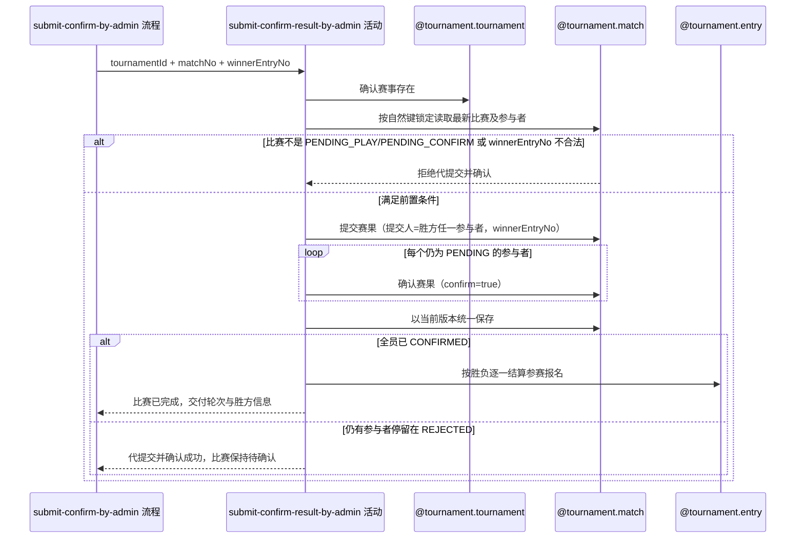

## 概要

按赛事和比赛序号锁定比赛，代提交代确认全部参与者赛果并结算胜负。

## 时序图

## 触发条件

运营流程已完成请求字段校验（含 `winnerEntryNo` 非空），对由 `tournamentId+matchNo` 唯一指定、状态为 `PENDING_PLAY` 或 `PENDING_CONFIRM` 的一场比赛发起代提交并代确认时执行。

## 活动契约

### 入参

| 字段 | 类型 | 必填 | 约束 |
|---|---|---|---|
| `tournamentId` | 字符串 | 是 | 已通过非空校验。 |
| `matchNo` | 整数 | 是 | 正整数。 |
| `winnerEntryNo` | 整数 | 是 | 已通过非空校验。 |

### 成功返回

| 字段 | 类型 | 必填 | 说明 |
|---|---|---|---|
| `matchCompleted` | 布尔 | 是 | 本次代提交并代确认后比赛是否已进入 `COMPLETED`；仍有参与者停留在 `REJECTED` 时为 `false`。 |
| `tournamentId` | 字符串 | 否 | `matchCompleted=true` 时给出，供轮次推进使用。 |
| `round` | 轮次 | 否 | `matchCompleted=true` 时给出已完成比赛的轮次。 |
| `winnerEntryNo` | 整数 | 否 | `matchCompleted=true` 时给出胜方参赛编号。 |
| `completedTime` | 日期时间 | 否 | `matchCompleted=true` 时给出比赛完成时间。 |

## 异常分支

| 错误标识 | 触发条件 | 来源 |
|---|---|---|
| `TOURNAMENT_NOT_FOUND` | 指定赛事不存在 | submit-confirm-by-admin 流程 `TOURNAMENT_NOT_FOUND` 一行 |
| `TOURNAMENT_MATCH_NOT_FOUND` | 指定赛事下不存在该比赛序号 | submit-confirm-by-admin 流程 `TOURNAMENT_MATCH_NOT_FOUND` 一行 |
| `TOURNAMENT_INVALID_RESULT_CONFIRM` | 比赛不是 `PENDING_PLAY` 或 `PENDING_CONFIRM` | submit-confirm-by-admin 流程 `TOURNAMENT_INVALID_RESULT_CONFIRM` 一行 |
| `TOURNAMENT_RESULT_WINNER_INVALID` | `winnerEntryNo` 不是本场比赛的参赛编号之一 | submit-confirm-by-admin 流程 `TOURNAMENT_RESULT_WINNER_INVALID` 一行 |
| `TOURNAMENT_ENTRY_NOT_FOUND` | 全员确认后，任一胜方或负方参与者没有对应赛事报名 | submit-confirm-by-admin 流程 `TOURNAMENT_ENTRY_NOT_FOUND` 一行 |
| `TOURNAMENT_MATCH_VERSION_CONFLICT` | 保存前比赛已被并发修改 | submit-confirm-by-admin 流程 `TOURNAMENT_MATCH_VERSION_CONFLICT` 一行 |
| `OPERATION_FAILED` | 比赛、参与关系或报名本次变化未能完整保存 | submit-confirm-by-admin 流程 `OPERATION_FAILED` 一行 |

## 领域依赖

### @tournament.tournament

- 输入：赛事编号与确认赛事存在的意图。
- 输出：赛事存在时返回赛事身份；不存在时返回失败结论。

### @tournament.match

- 输入：按 `tournamentId+matchNo` 自然键锁定读取最新根及全部参与者的意图；比赛处于 `PENDING_PLAY` 或 `PENDING_CONFIRM` 且 `winnerEntryNo` 是本场参赛编号之一时，以胜方参赛编号下任一参与者为提交人发起提交赛果命令（携带 `winnerEntryNo`，允许覆盖已有胜方并重置全员确认为 `PENDING`）；随后对每个赛果确认状态仍为 `PENDING` 的参与者依次发起确认赛果命令（`confirm=true`），最终以当前版本统一保存。
- 输出：正常时返回代提交并代确认后各参与者最新确认状态，以及比赛是否已全员确认并进入 `COMPLETED`（含胜方参赛编号、轮次和完成时间）；异常时给出比赛缺失、状态非法、胜方不合法或版本冲突结论。

### @tournament.entry

- 输入：比赛已进入 `COMPLETED` 时，对本场每一名参与者按其对应报名，发起结算比赛结果命令，传入胜负关系、比赛轮次和完成时间。
- 输出：正常时按赛段和轮次返回各报名的结算后状态（资格赛胜方 `PAYING`/负方 `WAITING`；非决赛正赛胜方晋级 `WAITING`/负方 `ELIMINATED`；决赛胜方 `CHAMPION`/负方 `ELIMINATED`）；异常时给出对应报名缺失结论。

## 业务动作

- A1 确认指定赛事存在。
- A2 按赛事编号和比赛序号锁定并加载最新比赛聚合及全部参与者，确认比赛为 `PENDING_PLAY` 或 `PENDING_CONFIRM`，且 `winnerEntryNo` 是本场参赛编号之一。
- A3 以胜方参赛编号下任一参与者为提交人，在同一内存聚合上提交赛果，写入 `winnerEntryNo`（原为空则记录，原已存在且不同则覆盖），提交人赛果确认状态置为 `CONFIRMED`，其余参与者重置为 `PENDING`。
- A4 对每个赛果确认状态仍为 `PENDING` 的参与者，依次在同一内存聚合上覆盖为 `CONFIRMED` 并刷新确认时间；已被记为 `REJECTED` 的参与者保持原状，不参与本次覆盖。
- A5 以当前版本统一保存比赛根与全部参与关系；全员确认时比赛进入 `COMPLETED` 并记录完成时间。
- A6 比赛进入 `COMPLETED` 后，按胜负方结算对应参赛报名。

## 详细流程

1. `A1` 只确认赛事身份存在，不要求赛事状态。
2. `A2` 按自然键取得比赛根与全部参与者；查不到报比赛不存在；比赛不是 `PENDING_PLAY` 或 `PENDING_CONFIRM` 时拒绝；`winnerEntryNo` 不是本场参赛编号之一时拒绝，均不修改任何对象。
3. `A3` 提交人取胜方参赛编号下任一参与者的 `userId`；提交赛果命令写入 `winnerEntryNo` 并把提交人置为 `CONFIRMED`，其余参与者（含此前已 `CONFIRMED` 的）重置为 `PENDING`；此步骤同时完成了对原有胜方（若存在且不同）的覆盖。
4. `A4` 逐个覆盖仍为 `PENDING` 的参与者为 `CONFIRMED` 并记录确认时间；已被记为 `REJECTED` 的参与者保持原状，不覆盖。
5. `A5` 全部参与者确认状态凑齐为 `CONFIRMED` 后，以版本条件将比赛改为 `COMPLETED` 并记录完成时间；条件未命中报版本冲突；仍有参与者停留在 `REJECTED` 时比赛保持 `PENDING_CONFIRM`，不进入 `A6`。
6. `A6` 仅在比赛进入 `COMPLETED` 时执行：按胜方参赛编号找出胜方与负方参与者，分别结算各自对应的赛事报名；任一参与者没有对应报名时报告报名不存在。
7. `A3` 至 `A6` 在同一事务内完成；任一必要保存失败整体回滚。

## 边界情况

- 比赛已是 `COMPLETED` 且胜方与本次 `winnerEntryNo` 一致时按幂等处理，不重复提交、不重复结算，`matchCompleted` 返回 `true` 但不重复调用结算命令。
- 比赛已是 `PENDING_CONFIRM` 且 `winnerEntryNo` 与已记录胜方不同（覆盖场景）：`A3` 重新提交赛果会把此前已 `CONFIRMED` 的参与者一并重置为 `PENDING`，再由 `A4` 统一补齐为 `CONFIRMED`，历史确认时间失效，按本次操作重新记录。
- 代提交并代确认后仍有参与者停留在 `REJECTED`，无法凑齐全部 `CONFIRMED` 时，本次按成功返回，`matchCompleted=false`，比赛保持 `PENDING_CONFIRM`，不结算报名、不推进轮次；待该参与者的拒绝被其他方式处理后可再次代提交并代确认。
- 双打同队参与者共享参赛编号，但各自独立拥有赛果确认状态，按参与者逐人处理，不做队内一致性提示。
- 本活动不发起报名费支付、不占用正赛席位，资格赛胜方仅进入 `PAYING`。
- 成功不发送通知，不记录运营操作人。

## 实现提示

在同一次内存加载的聚合上先调用提交赛果命令（携带运营指定的 `winnerEntryNo`，覆盖已有胜方并重置全员确认），再连续对每个待确认参与者调用确认赛果命令，最终统一以当前 `version` 做一次条件保存；仓储加载方式与 `tournament.booking-confirm-admin.activity.confirm-booking-by-admin` 一致。轮次推进与赛事终态交由 `tournament.result-submit-confirm-admin.activity.advance-tournament-progress` 处理，本活动只负责比赛完成与报名结算。提交赛果命令（`@tournament.match` C6）需要 domain 层把前置状态从仅 `PENDING_PLAY` 扩展为 `PENDING_PLAY` 或 `PENDING_CONFIRM`，允许覆盖已有胜方。
