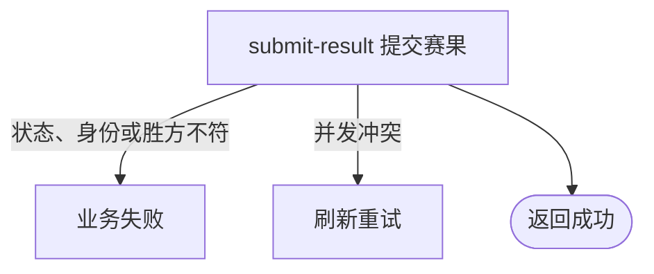

## 概要

让比赛参与者申报获胜参赛单元，并将比赛推进到赛果确认。

## 触发

处于待比赛状态的任一参与者要申报本场获胜参赛单元时发起。

## 接口契约

请求体包含非空 `matchId` 和非空 `winnerEntryNo`；后端不接收订阅相关字段。成功返回无数据响应。

## 业务活动

- submit-result  记录胜方并重置各参与者赛果确认状态

## 流程图

## 详细流程

1. 识别当前登录用户，接收比赛编号和获胜方参赛编号。
2. 取得比赛及全部参与者，确认比赛为 `PENDING_PLAY`。
3. 确认当前用户属于比赛参与者，且获胜方参赛编号属于本场对阵。
4. 保存获胜方、提交人和提交时间，将比赛改为 `PENDING_CONFIRM`。
5. 将提交人的赛果确认改为 `CONFIRMED` 并记录时间，其他参与者改为 `PENDING` 并清空原确认时间，事务性保存。
6. 返回成功；本流程不登记订阅信息，也不发送通知。

## 异常分支

| 对外失败码 | 触发条件 | 由哪个活动报出 | 补偿动作或超时处理 | 对外提示 |
|---|---|---|---|---|
| 未登录/参数校验错误 | 无有效登录，比赛编号空白，或胜方未提供 | 入口鉴权与校验 | 不修改 | 统一登录提示／比赛ID不能为空／获胜方不能为空 |
| `TOURNAMENT_ENTRY_NOT_FOUND` | 比赛不存在，或当前用户不是参与者 | submit-result | 不修改 | 报名记录不存在 |
| `TOURNAMENT_INVALID_RESULT_SUBMIT` | 比赛不是 `PENDING_PLAY` | submit-result | 比赛与参与关系不变 | 当前状态不允许提交结果 |
| `TOURNAMENT_RESULT_WINNER_REQUIRED` | 获胜方参赛编号不属于本场对阵 | submit-result | 不修改 | 请选择获胜方 |
| `TOURNAMENT_MATCH_VERSION_CONFLICT` | 保存前比赛已被并发修改 | submit-result | 事务回滚，保留先保存结果 | 比赛状态已变更，请刷新后重试 |
| `OPERATION_FAILED` | 比赛或参与关系保存失败 | submit-result | 事务回滚，不交付部分赛果 | 系统异常，请稍后重试 |

## 技术线索

- HTTP：`POST /tournament/match/submit-result`
- 请求：`SubmitResultCmd`
- 调用：`TournamentMatchAppService.submitResult()` → `TournamentMatchFlowService.submitResult()` → `TournamentMatch.submitResult()`
- 并发：`TournamentMatchRepository.updateWithVersion()`
