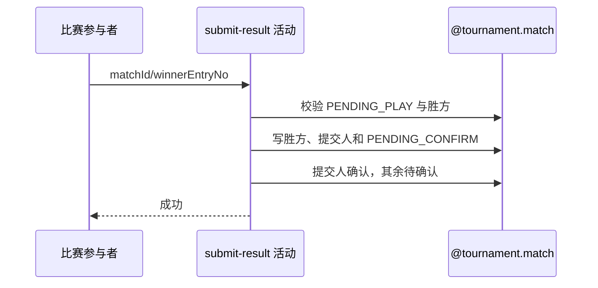

## 概要

记录获胜参赛单元，并重置参与者赛果确认状态。

## 时序图

## 触发条件

PENDING_PLAY 比赛的参与者提交本场有效 winnerEntryNo 时执行。

## 活动契约

胜方必须属于本场；保存胜方、提交人和提交时间，比赛转 PENDING_CONFIRM，提交人 CONFIRMED，其余参与者重置 PENDING。

## 异常分支

| 错误标识 | 触发条件 | 处理 |
|---|---|---|
| `TOURNAMENT_ENTRY_NOT_FOUND` | 比赛不存在或本人非参与者 | 不修改 |
| `TOURNAMENT_INVALID_RESULT_SUBMIT` | 比赛非 PENDING_PLAY | 不修改 |
| `TOURNAMENT_RESULT_WINNER_REQUIRED` | 胜方不属于本场 | 不修改 |
| `TOURNAMENT_MATCH_VERSION_CONFLICT`/`OPERATION_FAILED` | 并发或保存失败 | 事务回滚 |

## 领域依赖

### @tournament.match
- 输入：PENDING_PLAY 比赛、提交人、胜方与版本
- 输出：PENDING_CONFIRM 比赛及重置确认

## 业务动作

A1 校验比赛和提交人
A2 校验胜方属于对阵
A3 记录赛果提交
A4 重置全员确认状态

## 详细流程

1. 读取比赛与全部参与者，要求状态 PENDING_PLAY 且当前用户属于参与者。
2. winnerEntryNo 必须等于本场某参与单元编号，否则按未选胜方失败。
3. 写 winnerEntryNo、submittedBy、submittedTime，比赛转 PENDING_CONFIRM。
4. 提交人的 resultConfirmation=CONFIRMED 并记时间，其他人改 PENDING 且清原确认时间。
5. 以版本条件同事务保存比赛和参与关系；本活动不触发通知。

## 边界情况

- 任一参与者都能提交，不限胜方成员。
- 新提交会清除其他参与者可能残留的确认时间。
- 成功只表示进入待确认，尚未结算报名。

## 实现提示
