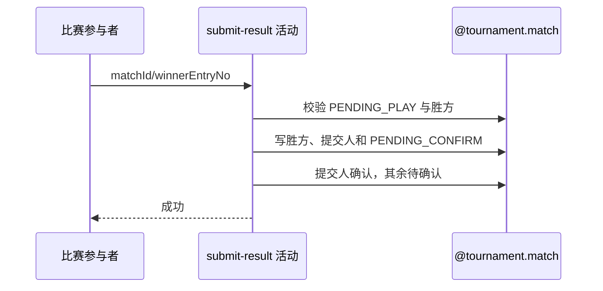

## 概要

记录获胜参赛单元，并重置参与者赛果确认状态。

## 时序图

## 触发条件

PENDING_PLAY 比赛的参与者提交本场有效 winnerEntryNo 时执行。

## 活动契约

### 入参

| 字段 | 类型 | 必填 | 约束 |
|---|---|---|---|
| `matchId` | 字符串 | 是 | 目标比赛编号 |
| `winnerEntryNo` | 字符串 | 是 | 必须等于本场某个参赛单元编号 |
| `operatorId` | 字符串 | 是 | 必须属于本场任一参与者，不要求属于胜方 |
| `submittedTime` | 日期时间 | 是 | 同时作为提交人的确认时间 |

### 成功返回

| 字段 | 类型 | 必填 | 说明 |
|---|---|---|---|
| 无 | - | - | 比赛进入待确认后不返回数据 |

## 异常分支

| 错误标识 | 触发条件 | 来源 |
|---|---|---|
| `TOURNAMENT_ENTRY_NOT_FOUND` | 比赛不存在或本人非参与者 | submit-result 流程同名错误一行 |
| `TOURNAMENT_INVALID_RESULT_SUBMIT` | 比赛非 `PENDING_PLAY` | submit-result 流程同名错误一行 |
| `TOURNAMENT_RESULT_WINNER_REQUIRED` | 胜方不属于本场 | submit-result 流程同名错误一行 |
| `TOURNAMENT_MATCH_VERSION_CONFLICT` | 保存前比赛已被并发修改 | submit-result 流程同名错误一行 |
| `OPERATION_FAILED` | 比赛或参与关系未完整保存 | submit-result 流程同名错误一行 |

## 领域依赖

### @tournament.match

- 输入：PENDING_PLAY 比赛、提交人、胜方与版本
- 输出：PENDING_CONFIRM 比赛及重置确认

## 业务动作

- A1 校验比赛和提交人。
- A2 校验胜方属于对阵。
- A3 记录赛果提交。
- A4 重置全员确认状态。

## 详细流程

1. A1 读取比赛与全部参与者，要求状态 `PENDING_PLAY` 且当前用户属于参与者。
2. A2 `winnerEntryNo` 必须等于本场某参与单元编号，否则按未选胜方失败。
3. A3 写 `winnerEntryNo`、`submittedBy`、`submittedTime`，比赛转 `PENDING_CONFIRM`。
4. A4 提交人的 `resultConfirmation=CONFIRMED` 并记时间，其他人改为 `PENDING` 且清空原确认时间。
5. A3/A4 以版本条件同事务保存比赛和参与关系；本活动不触发通知。

## 边界情况

- 任一参与者都能提交，不限胜方成员。
- 新提交会清除其他参与者可能残留的确认时间。
- 成功只表示进入待确认，尚未结算报名。

## 实现提示

写活动 `reads` 为空；比赛与参与确认使用同一事务并通过比赛版本条件保存。
