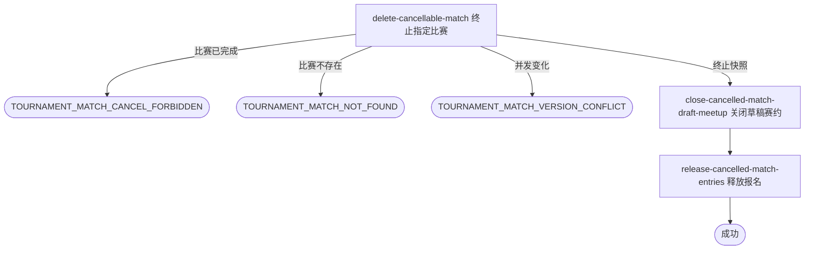

## 概要

让运营终止一场未完成比赛并保留完整比赛历史。

## 触发

后台运营按赛事编号和比赛序号一次终止一场比赛。目标已为 `REJECTED` 时重复请求幂等成功，并继续安全重试草稿赛约关闭与报名释放；现有按赛事批量取消未订场比赛的入口保持原物理删除语义。

## 接口契约

### 请求参数

| 字段 | 类型 | 必填 | 约束 |
|---|---|---|---|
| `tournamentId` | String | 是 | 非空，必须对应已存在赛事。 |
| `matchNo` | Integer | 是 | 正整数，与 `tournamentId` 共同唯一定位比赛。 |

### 成功响应

无

## 业务活动

- delete-cancellable-match  锁定并把指定未完成比赛终止为 `REJECTED`，保留比赛与参与者并交付联动快照
- close-cancelled-match-draft-meetup  关闭快照中仍为草稿的关联赛约
- release-cancelled-match-entries  将快照中仍处于比赛中的报名释放回匹配池

## 流程图

## 详细流程

1. 接收并校验赛事编号和正整数比赛序号，确认赛事存在。
2. 按赛事编号和比赛序号取得最新比赛及全部参与者；比赛已完成时拒绝终止。
3. 比赛尚未完成且不是 `REJECTED` 时，将比赛状态更新为 `REJECTED` 并递增版本；比赛其他字段和全部参与关系保持不变。
4. 比赛已为 `REJECTED` 时不重复更新版本，直接使用当前比赛与参与者生成联动快照。
5. 快照关联的赛约仍为草稿时将其关闭；赛约缺失或不是草稿时保持原状。
6. 按快照逐人处理报名，仅将仍为比赛中的报名改回等待匹配，其他状态保持不变。
7. 比赛终止、草稿赛约关闭和报名释放在同一事务内完成；成功后返回无数据响应，不自动重新匹配。

## 异常分支

| 对外失败码 | 触发条件 | 由哪个活动报出 | 补偿动作或超时处理 | 对外提示 |
|---|---|---|---|---|
| 无权限/参数校验错误 | 运营访问无效、`tournamentId` 空白或 `matchNo` 不是正整数 | 流程 | 不读取或修改 | 无权限访问／赛事ID不能为空／比赛序号必须为正整数 |
| `TOURNAMENT_NOT_FOUND` | 指定赛事不存在 | delete-cancellable-match | 不修改比赛、报名和赛约 | 赛事不存在 |
| `TOURNAMENT_MATCH_NOT_FOUND` | 指定赛事下不存在该比赛序号 | delete-cancellable-match | 不补建或修改任何对象 | 比赛不存在 |
| `TOURNAMENT_MATCH_CANCEL_FORBIDDEN` | 目标比赛最新状态为 `COMPLETED` | delete-cancellable-match | 不修改任何联动对象 | 已完成比赛不能终止 |
| `TOURNAMENT_MATCH_VERSION_CONFLICT` | 首次终止时版本或状态发生并发变化 | delete-cancellable-match | 整个事务回滚 | 比赛状态已变更，请刷新后重试 |
| `OPERATION_FAILED` | 比赛状态、草稿赛约或报名未完整保存 | 任一活动 | 整个事务回滚 | 系统异常，请稍后重试 |

## 技术线索

- 新入口：`POST /tournament/admin/match/cancel/single`
- 请求字段：`tournamentId`、`matchNo`
- 终止状态：复用 `REJECTED`，不新增状态，不填写 `completedTime`
- 数据保留：保留比赛根、参与者、订场、确认、拒绝、重订和赛果草稿字段
- 旧入口保持不变：`POST /tournament/admin/match/cancel`
