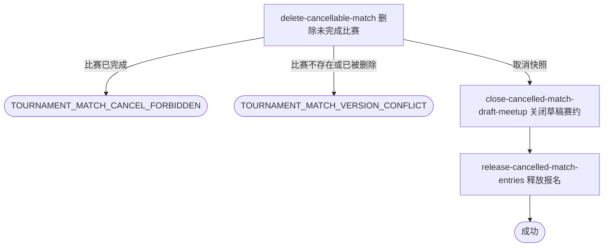

## 概要

让运营精确取消一场尚未完成的赛事比赛。

## 触发

运营人员在后台按赛事编号和比赛序号发起；一次请求只处理一场比赛。重复提交时，目标已被删除则返回比赛状态已变化，不把重复请求视为成功。现有按赛事批量撤销未订场比赛的入口保持不变。

## 接口契约

### 请求参数

| 字段 | 类型 | 必填 | 约束 |
|---|---|---|---|
| `tournamentId` | String | 是 | 非空，必须对应已存在赛事。 |
| `matchNo` | Integer | 是 | 必须为正整数，与 `tournamentId` 共同唯一定位比赛。 |

### 成功响应

无

## 业务活动

- delete-cancellable-match  校验并物理删除指定未完成比赛及其参与关系，交付取消快照
- close-cancelled-match-draft-meetup  关闭取消快照中仍为草稿的关联赛约
- release-cancelled-match-entries  将取消快照中仍处于比赛中的报名释放回匹配池

## 流程图

## 详细流程

1. 接收运营提交的赛事编号和正整数比赛序号，确认赛事存在。
2. 按赛事编号和比赛序号加载目标比赛及全部参与关系；比赛已完成时拒绝取消。
3. 若比赛在处理期间迁移到另一未完成状态，则以最新比赛、参与关系和关联赛约为准继续；若已完成或已被删除，则取消失败。
4. 在目标仍未完成的条件下物理删除比赛及全部参与关系，并保留联动所需的参与者与关联赛约快照。
5. 快照关联的赛约仍为草稿时将其关闭；赛约缺失或不是草稿时保持原状。
6. 按快照逐个处理报名，仅将仍为比赛中的报名改回等待匹配，其他报名状态保持不变。
7. 比赛删除、草稿赛约关闭和报名释放在同一事务内完成，成功后返回无数据响应；不自动重新匹配。

## 异常分支

| 对外失败码 | 触发条件 | 由哪个活动报出 | 补偿动作或超时处理 | 对外提示 |
|---|---|---|---|---|
| 无权限/参数校验错误 | 运营访问无效、`tournamentId` 空白或 `matchNo` 不是正整数 | 流程 | 不读取或修改 | 无权限访问／赛事ID不能为空／比赛序号必须为正整数 |
| `TOURNAMENT_NOT_FOUND` | 指定赛事不存在 | delete-cancellable-match | 不删除比赛，不修改报名和赛约 | 赛事不存在 |
| `TOURNAMENT_MATCH_NOT_FOUND` | 指定赛事下不存在该比赛序号 | delete-cancellable-match | 不补建或修改任何对象 | 比赛不存在 |
| `TOURNAMENT_MATCH_CANCEL_FORBIDDEN` | 目标比赛处理时已经为 `COMPLETED` | delete-cancellable-match | 不删除比赛，不修改报名和赛约 | 已完成比赛不能取消 |
| `TOURNAMENT_MATCH_VERSION_CONFLICT` | 目标在处理期间完成、被删除，或未能按未完成条件删除 | delete-cancellable-match | 整个事务回滚 | 比赛状态已变更，请刷新后重试 |
| `OPERATION_FAILED` | 比赛、参与关系、草稿赛约或报名变更未完整保存 | delete-cancellable-match／close-cancelled-match-draft-meetup／release-cancelled-match-entries | 整个事务回滚 | 系统异常，请稍后重试 |

## 技术线索

- 新入口：`POST /tournament/admin/match/cancel/single`
- 请求字段：`tournamentId`、`matchNo`
- 允许取消状态：除 `COMPLETED` 外的全部比赛状态
- 旧入口保持不变：`POST /tournament/admin/match/cancel`
