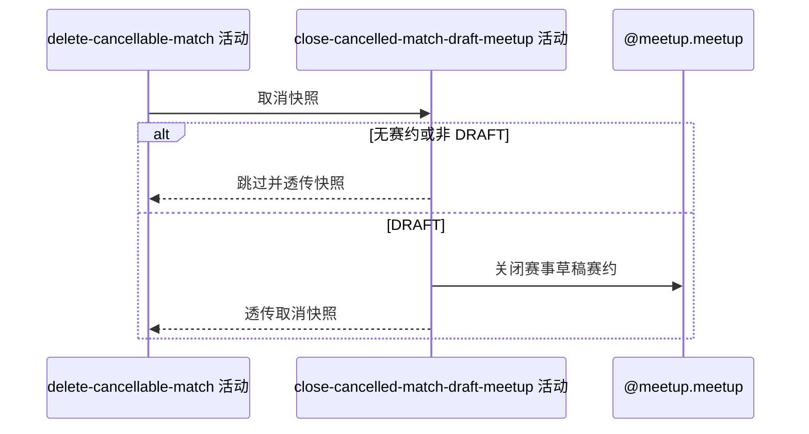

## 概要

关闭被取消比赛仍为草稿的关联赛约。

## 时序图

## 触发条件

上游已经物理删除一场未完成比赛并交付取消快照后执行。

## 活动契约

### 入参

| 字段 | 类型 | 必填 | 约束 |
|---|---|---|---|
| `cancellationSnapshot` | 比赛取消快照 | 是 | 由 delete-cancellable-match 返回。 |

### 成功返回

| 字段 | 类型 | 必填 | 说明 |
|---|---|---|---|
| `cancellationSnapshot` | 比赛取消快照 | 是 | 原样透传给报名释放活动。 |

## 异常分支

| 错误标识 | 触发条件 | 来源 |
|---|---|---|
| `OPERATION_FAILED` | 草稿赛约状态未能保存为关闭 | cancel-single-match 流程 `OPERATION_FAILED` 一行 |

## 领域依赖

### @meetup.meetup

- 输入：取消快照中的可选赛约编号与关闭赛事草稿赛约的意图
- 输出：存储状态为 `DRAFT` 时迁移为 `CLOSED`；编号为空、记录缺失或状态不是 `DRAFT` 时返回无需变更，保存失败时返回失败结论

## 业务动作

A1 读取取消快照中的关联赛约编号
A2 按需加载赛约并请求关闭赛事草稿
A3 透传取消快照

## 详细流程

1. `A1` 发现 `meetupId` 为空时直接进入 `A3`。
2. `A2` 按编号查询赛约；记录缺失或存储状态不是 `DRAFT` 时不修改并进入 `A3`，只有 `DRAFT` 调用聚合的赛事草稿关闭命令并保存。
3. 草稿关闭保存失败时抛出异常，由外层事务回滚已经完成的比赛删除；成功或无需变更时 `A3` 原样返回取消快照。

## 边界情况

- 只看持久化状态，`OPEN` 按时间推导出的 `ONGOING/FINISHED` 不在本活动关闭范围。
- 已经 `CLOSED` 的赛约按无需变更处理。
- 本活动不删除赛约和报名，不修改费用、聊天或活动时间。

## 实现提示

复用 `@meetup.meetup` 的关闭赛事草稿命令；写活动 `reads` 为空，不把赛约缺失解释为错误。
