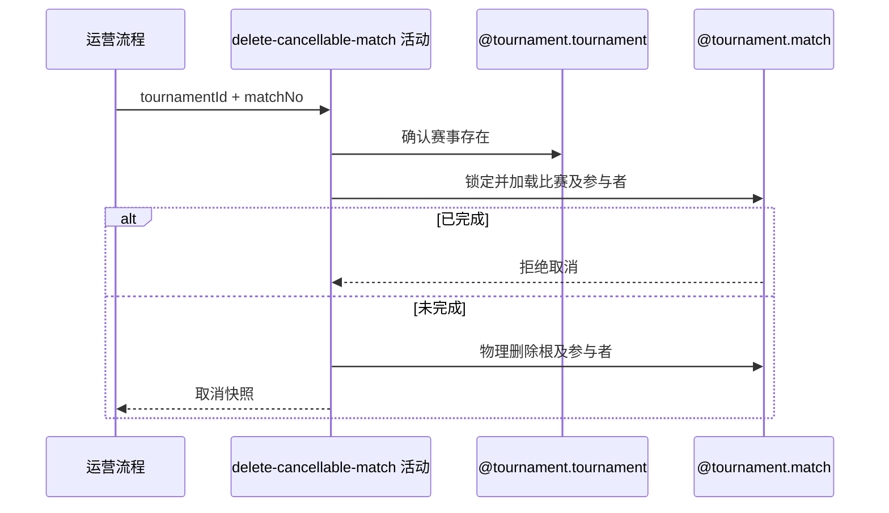

## 概要

物理删除指定未完成比赛并交付联动快照。

## 时序图

## 触发条件

运营流程已完成请求字段校验，要取消由 `tournamentId+matchNo` 唯一指定的一场比赛时执行；允许状态为除 `COMPLETED` 外的全部状态。

## 活动契约

### 入参

| 字段 | 类型 | 必填 | 约束 |
|---|---|---|---|
| `tournamentId` | 字符串 | 是 | 已通过非空校验。 |
| `matchNo` | 整数 | 是 | 正整数。 |

### 成功返回

| 字段 | 类型 | 必填 | 说明 |
|---|---|---|---|
| `tournamentId` | 字符串 | 是 | 被取消比赛所属赛事。 |
| `matchId` | 字符串 | 是 | 被物理删除比赛的业务编号。 |
| `matchNo` | 整数 | 是 | 被取消比赛的赛事内序号。 |
| `meetupId` | 字符串 | 否 | 删除前关联的赛约编号。 |
| `participants` | 参与者快照列表 | 是 | 删除前全部参与者的 `userId` 与 `entryNo`。 |

## 异常分支

| 错误标识 | 触发条件 | 来源 |
|---|---|---|
| `TOURNAMENT_NOT_FOUND` | 指定赛事不存在 | cancel-single-match 流程 `TOURNAMENT_NOT_FOUND` 一行 |
| `TOURNAMENT_MATCH_NOT_FOUND` | 首次按赛事和比赛序号查不到目标 | cancel-single-match 流程 `TOURNAMENT_MATCH_NOT_FOUND` 一行 |
| `TOURNAMENT_MATCH_CANCEL_FORBIDDEN` | 锁定后的最新比赛状态为 `COMPLETED` | cancel-single-match 流程 `TOURNAMENT_MATCH_CANCEL_FORBIDDEN` 一行 |
| `TOURNAMENT_MATCH_VERSION_CONFLICT` | 已加载目标在条件删除时不再存在或已经完成 | cancel-single-match 流程 `TOURNAMENT_MATCH_VERSION_CONFLICT` 一行 |
| `OPERATION_FAILED` | 比赛根或参与关系未完整删除 | cancel-single-match 流程 `OPERATION_FAILED` 一行 |

## 领域依赖

### @tournament.tournament

- 输入：赛事编号与确认赛事存在的意图
- 输出：赛事存在时返回赛事身份；不存在时返回失败结论

### @tournament.match

- 输入：赛事编号、比赛序号与运营物理取消意图
- 输出：最新状态未完成时返回包含联动字段的取消快照并删除根及参与者；目标缺失、已完成或条件删除冲突时返回失败结论

## 业务动作

A1 确认指定赛事存在
A2 按赛事编号和比赛序号锁定并加载最新比赛聚合
A3 请求比赛聚合判定运营取消并生成取消快照
A4 按最新状态非完成条件物理删除比赛根及全部参与者
A5 返回取消快照供后续活动联动

## 详细流程

1. `A1` 只确认赛事身份存在，不要求赛事状态或当前轮次。
2. `A2` 按自然键取得比赛根与全部参与者；首次无结果报比赛不存在。锁定等待结束后使用最新记录，不沿用锁前旧快照。
3. `A3` 由比赛聚合拒绝 `COMPLETED`；`MATCHED/BOOKING/SCHEDULED/PENDING_PLAY/PENDING_CONFIRM/REJECTED` 均生成包含关联赛约和全部参与者的取消快照。
4. `A4` 在状态仍非 `COMPLETED` 的条件下删除根与全部参与者；条件未命中作为并发冲突，活动不返回快照。
5. `A5` 仅在根与参与者均完成删除后返回快照；本活动与后续赛约关闭、报名释放共享一个外层事务。

## 边界情况

- `REJECTED` 属于可取消状态，删除后其拒绝历史不再保留。
- 参与者列表为空时仍允许删除异常比赛，返回空列表供后续活动正常完成。
- `meetupId` 为空不影响比赛删除。
- 初次查询缺失与已加载后并发删除分档处理，重复请求不幂等成功。

## 实现提示

优先使用自然键锁定读取最新根，再以 `status <> COMPLETED` 条件删除；写活动 `reads` 为空。参与者必须在删除前完整装载并放入返回快照。
