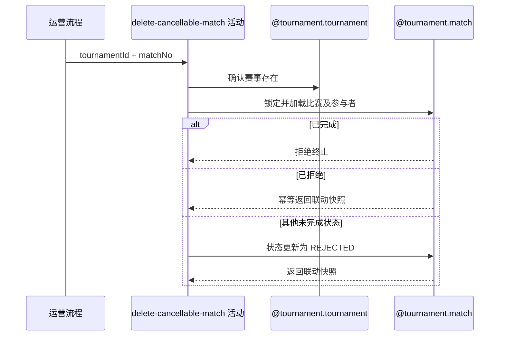

## 概要

终止指定未完成比赛并交付联动快照。

## 时序图

## 触发条件

运营流程已完成请求字段校验，要终止由 `tournamentId+matchNo` 唯一指定的一场比赛时执行；除 `COMPLETED` 外均可处理，`REJECTED` 按幂等成功处理。

## 活动契约

### 入参

| 字段 | 类型 | 必填 | 约束 |
|---|---|---|---|
| `tournamentId` | 字符串 | 是 | 已通过非空校验。 |
| `matchNo` | 整数 | 是 | 正整数。 |

### 成功返回

| 字段 | 类型 | 必填 | 说明 |
|---|---|---|---|
| `tournamentId` | 字符串 | 是 | 被终止比赛所属赛事。 |
| `matchId` | 字符串 | 是 | 保留比赛的业务编号。 |
| `matchNo` | 整数 | 是 | 被终止比赛的赛事内序号。 |
| `meetupId` | 字符串 | 否 | 当前关联赛约编号。 |
| `participants` | 参与者快照列表 | 是 | 当前全部参与者的 `userId` 与 `entryNo`。 |

## 异常分支

| 错误标识 | 触发条件 | 来源 |
|---|---|---|
| `TOURNAMENT_NOT_FOUND` | 指定赛事不存在 | cancel-single-match 流程 `TOURNAMENT_NOT_FOUND` 一行 |
| `TOURNAMENT_MATCH_NOT_FOUND` | 首次按赛事和比赛序号查不到目标 | cancel-single-match 流程 `TOURNAMENT_MATCH_NOT_FOUND` 一行 |
| `TOURNAMENT_MATCH_CANCEL_FORBIDDEN` | 锁定后的最新比赛状态为 `COMPLETED` | cancel-single-match 流程 `TOURNAMENT_MATCH_CANCEL_FORBIDDEN` 一行 |
| `TOURNAMENT_MATCH_VERSION_CONFLICT` | 首次终止的版本或状态条件未命中 | cancel-single-match 流程 `TOURNAMENT_MATCH_VERSION_CONFLICT` 一行 |
| `OPERATION_FAILED` | 比赛终止状态未完整保存 | cancel-single-match 流程 `OPERATION_FAILED` 一行 |

## 领域依赖

### @tournament.tournament

- 输入：赛事编号与确认赛事存在的意图
- 输出：赛事存在时返回赛事身份；不存在时返回失败结论

### @tournament.match

- 输入：赛事编号、比赛序号与运营终止意图
- 输出：非完成比赛保留根和参与者并进入 `REJECTED`，返回包含联动字段的快照；目标缺失、已完成或条件更新冲突时返回失败结论

## 业务动作

A1 确认指定赛事存在
A2 按赛事编号和比赛序号锁定并加载最新比赛聚合
A3 请求比赛聚合判定运营终止并生成当前联动快照
A4 对首次终止按版本和状态条件把比赛根更新为 `REJECTED`
A5 返回保留比赛的联动快照供后续活动处理

## 详细流程

1. `A1` 只确认赛事身份存在，不要求赛事状态、当前轮次或比赛所属轮次。
2. `A2` 按自然键取得比赛根与全部参与者；首次无结果报比赛不存在，锁定等待结束后使用最新记录。
3. `A3` 由比赛聚合拒绝 `COMPLETED`；`REJECTED` 不再写根，直接从当前记录生成快照；其他状态生成同样的当前快照并进入首次终止。
4. `A4` 仅首次终止执行，以业务编号、当前版本及状态非 `COMPLETED/REJECTED` 为条件把状态更新为 `REJECTED`、版本递增一；拒绝、订场、确认、重订、赛果与参与者字段保持原值，条件未命中报并发冲突。
5. `A5` 在首次条件更新成功或已为 `REJECTED` 时返回快照；本活动与后续赛约关闭、报名释放共享一个外层事务。

## 边界情况

- `REJECTED` 重复请求幂等成功，不递增比赛版本，但仍返回当前参与者和赛约快照供联动重试。
- 参与者列表为空时仍允许终止历史异常比赛，返回空列表供后续活动正常完成。
- `meetupId` 为空不影响比赛状态终止。
- 比赛根和参与者均不删除；`completedTime`、拒绝审计和其他比赛字段保持原值。

## 实现提示

优先使用自然键锁定读取最新根，再以 `status <> COMPLETED` 条件删除；写活动 `reads` 为空。参与者必须在删除前完整装载并放入返回快照。
