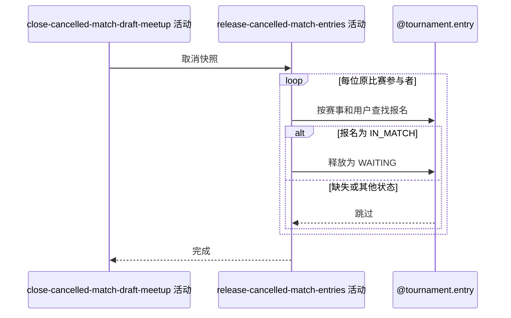

## 概要

将被取消比赛中仍在赛的报名释放回匹配池。

## 时序图

## 触发条件

目标比赛已删除、关联草稿赛约已按需关闭，并取得包含原参与者的取消快照后执行。

## 活动契约

### 入参

| 字段 | 类型 | 必填 | 约束 |
|---|---|---|---|
| `cancellationSnapshot` | 比赛取消快照 | 是 | 包含赛事编号和删除前全部参与者。 |

### 成功返回

无

## 异常分支

| 错误标识 | 触发条件 | 来源 |
|---|---|---|
| `OPERATION_FAILED` | 任一需要释放的报名未能保存 | cancel-single-match 流程 `OPERATION_FAILED` 一行 |

## 领域依赖

### @tournament.entry

- 输入：取消快照中每位参与者对应的报名与比赛已取消事实
- 输出：报名仍为 `IN_MATCH` 时迁移为 `WAITING`；报名缺失或其他状态时返回无需变更，保存失败时返回失败结论

## 业务动作

A1 遍历取消快照中的原比赛参与者
A2 按赛事编号和用户编号查找报名
A3 将仍为比赛中的报名释放为等待匹配
A4 完成本次报名释放

## 详细流程

1. `A1` 只遍历快照明确记录的参与者，不按相同 `entryNo` 扩展查询其他报名；空列表直接进入 `A4`。
2. `A2` 使用快照的 `tournamentId+userId` 查找报名；报名缺失时跳过当前参与者，不补建、不报错。
3. `A3` 仅对当前仍为 `IN_MATCH` 的报名调用释放命令并保存为 `WAITING`；其他状态原样保留。
4. 任一实际需要保存的报名失败时，外层事务回滚比赛删除、赛约关闭及此前报名释放；全部处理完成后 `A4` 返回无数据。

## 边界情况

- 同一用户异常重复出现在快照时，首次释放后后续处理观察到 `WAITING` 并跳过。
- 双打只处理比赛参与关系中的成员；报名缺失或状态不一致可能导致参赛单元部分释放，但不阻断运营取消。
- 不递增拒绝次数，不改变轮次、阶段、搭档、偏好或支付事实。

## 实现提示

写活动 `reads` 为空；沿用既有取消服务对报名缺失和非 `IN_MATCH` 状态的宽容语义。
