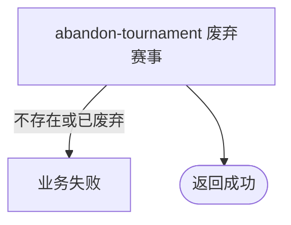

## 概要

由运营将草稿或有效赛事终止为已废弃。

## 触发

持有后台共享访问密钥的运营调用方要终止一项未废弃赛事时发起。

## 接口契约

请求体含非空 `tournamentId` 与可选 `reason`；原因当前不产生业务效果。成功返回标准成功响应且 `data=null`。

## 业务活动

- abandon-tournament  将未废弃赛事状态改为已废弃

## 流程图

## 详细流程

1. 后台共享 API Key 鉴权后，接收非空赛事编号和可选原因，按业务编号取得赛事。
2. 允许 `DRAFT` 或 `ACTIVE`，已经 `ABANDONED` 时拒绝；请求原因不保存、不使用。
3. 将状态改为 `ABANDONED` 并在事务内保存，其他配置、当前轮次、席位、结束时间与关联数据不变。
4. 成功返回无数据响应；不删除赛事，不处理报名、在途比赛、赛约、支付、线下活动、退款或通知，也不记录操作人。

## 异常分支

| 对外失败码 | 触发条件 | 由哪个活动报出 | 补偿动作或超时处理 | 对外提示 |
|---|---|---|---|---|
| 无权限 | 后台 API Key 缺失或不匹配 | 后台鉴权 | 不废弃 | 无权限访问 |
| 参数校验错误 | 赛事编号空白 | 入口校验 | 不废弃 | 赛事ID不能为空 |
| `TOURNAMENT_NOT_FOUND` | 赛事不存在 | abandon-tournament | 不废弃 | 赛事不存在 |
| 状态错误 | 赛事已为 ABANDONED | abandon-tournament | 保持已废弃，不按幂等成功 | 赛事当前状态不允许该操作 |
| `OPERATION_FAILED` | 保存异常 | abandon-tournament | 事务回滚，保持原状态 | 系统异常，请稍后重试 |

## 技术线索

- HTTP：`POST /tournament/admin/abandon`
- 请求：`TournamentAbandonCmd`，`reason` 未传入领域层
- 调用：`TournamentAdminAppService.abandon()` → `TournamentAdminService.abandon()` → `Tournament.abandon()`
- 事务：应用服务 `@Transactional`
