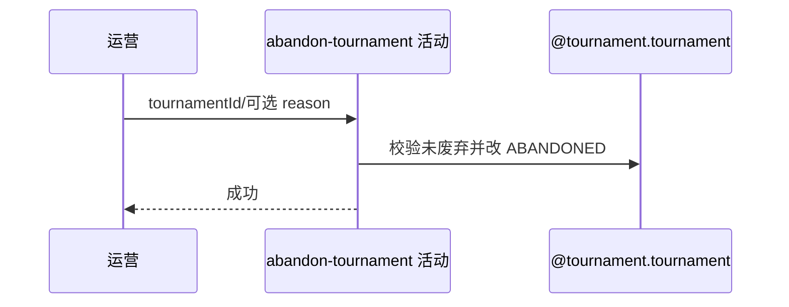

## 概要

将未废弃赛事状态改为 ABANDONED，不联动关联业务。

## 时序图

## 触发条件

后台运营终止 DRAFT 或 ACTIVE 赛事时执行。

## 活动契约

允许 DRAFT/ACTIVE 转 ABANDONED；已废弃重复调用失败。reason 当前不保存，报名、比赛、赛约、支付和通知均不处理。

## 异常分支

| 错误标识 | 触发条件 | 处理 |
|---|---|---|
| `TOURNAMENT_NOT_FOUND` | 赛事不存在 | 不修改 |
| 状态错误 | 已为 ABANDONED | 保持原状，不幂等成功 |
| `OPERATION_FAILED` | 保存失败 | 事务回滚 |

## 领域依赖

### @tournament.tournament
- 输入：赛事当前状态
- 输出：ABANDONED 状态

## 业务动作

A1 取得赛事
A2 校验未废弃
A3 标记 ABANDONED

## 详细流程

1. 后台 API Key 通过后按 bizId 取得赛事；仅 DRAFT/ACTIVE 可继续。
2. 请求 reason 不传入领域、不保存；只把 status 改 ABANDONED。
3. 单事务保存，其他配置、轮次、锁位、结束时间和关联数据不变。
4. 不删除或结算报名、比赛、赛约、支付、线下活动，也不退款、通知或记操作人。

## 边界情况

- 废弃 ACTIVE 赛事会留下所有在途对象原状态。
- 重复废弃不是幂等成功。
- reason 即使提供也丢弃。

## 实现提示

写入使用 `@tournament.tournament`，`reads` 为空。
