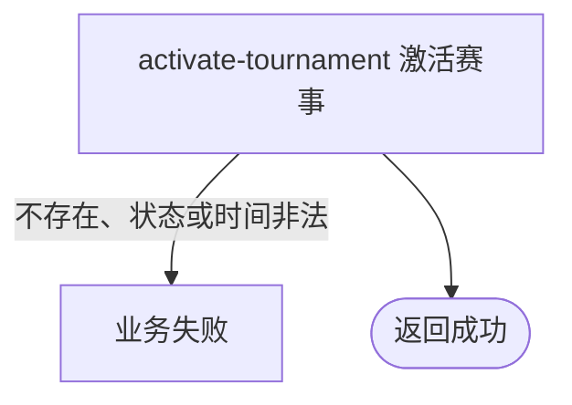

## 概要

由运营将时间配置可用的赛事草稿激活。

## 触发

持有后台共享访问密钥的运营调用方要开放一项赛事草稿时发起。

## 接口契约

请求体只需非空 `tournamentId`。成功返回标准成功响应且 `data=null`。

## 业务活动

- activate-tournament  校验草稿状态和核心时间后激活赛事

## 流程图

## 详细流程

1. 后台共享 API Key 鉴权后，接收非空赛事编号并按业务编号取得赛事。
2. 仅允许当前 `DRAFT`；ACTIVE、ABANDONED 或其他状态均拒绝。
3. 只核对报名开始时间和资格赛开始时间都存在，且报名开始严格早于资格赛开始；不复核其他配置、截止时间或与当前时间关系。
4. 将状态改为 `ACTIVE` 并在事务内保存，其他配置、轮次、席位和关联数据不变。成功返回无数据响应，不自动开始报名或匹配。

## 异常分支

| 对外失败码 | 触发条件 | 由哪个活动报出 | 补偿动作或超时处理 | 对外提示 |
|---|---|---|---|---|
| 无权限 | 后台 API Key 缺失或不匹配 | 后台鉴权 | 不激活 | 无权限访问 |
| 参数校验错误 | 赛事编号空白 | 入口校验 | 不激活 | 赛事ID不能为空 |
| `TOURNAMENT_NOT_FOUND` | 赛事不存在 | activate-tournament | 不激活 | 赛事不存在 |
| 状态/配置错误 | 当前不是 DRAFT，或两个核心时间缺失/次序非法 | activate-tournament | 事务回滚，保持原状态 | 赛事当前状态不允许、配置不完整或时间点设置不合法 |
| `OPERATION_FAILED` | 保存异常 | activate-tournament | 事务回滚 | 系统异常，请稍后重试 |

## 技术线索

- HTTP：`POST /tournament/admin/activate`
- 请求：`TournamentActivateCmd`
- 调用：`TournamentAdminAppService.activate()` → `TournamentAdminService.activate()` → `Tournament.activate()`
- 事务：应用服务 `@Transactional`
