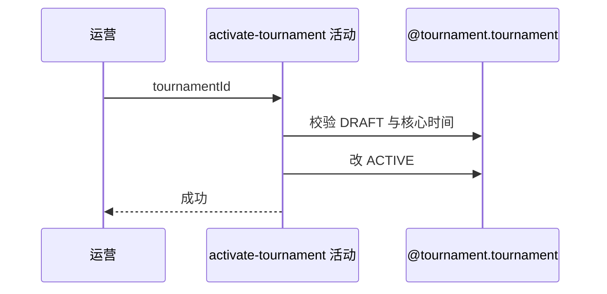

## 概要

校验草稿和两个核心时间后把赛事激活。

## 时序图

## 触发条件

后台运营开放一项 DRAFT 赛事时执行。

## 活动契约

仅检查 registrationStartTime 与 qualifierStartTime 存在且前者严格早于后者；通过后 DRAFT→ACTIVE，不自动创建或推进其他对象。

## 异常分支

| 错误标识 | 触发条件 | 处理 |
|---|---|---|
| `TOURNAMENT_NOT_FOUND` | 赛事不存在 | 不修改 |
| 状态/配置错误 | 非 DRAFT、核心时间缺失或次序非法 | 保持原状态 |
| `OPERATION_FAILED` | 保存失败 | 事务回滚 |

## 领域依赖

### @tournament.tournament
- 输入：DRAFT 赛事与核心时间
- 输出：ACTIVE 赛事

## 业务动作

A1 校验 DRAFT
A2 校验核心时间次序
A3 激活赛事

## 详细流程

1. 后台 API Key 通过后按 bizId 取得赛事，仅 DRAFT 可激活。
2. registrationStartTime、qualifierStartTime 均须非空，且报名开始严格早于资格赛开始。
3. 不复核完整配置、报名截止、资格赛截止或这些时间与当前时刻的关系。
4. status 改 ACTIVE 并事务保存；当前轮次、锁位和关联不变，不自动开始报名或匹配。

## 边界情况

- 已 ACTIVE 的重复调用失败，不幂等。
- 即使报名时间已过去，只要两时间次序合法仍可激活。
- 其他配置缺陷可能在后续流程暴露。

## 实现提示

写入使用 `@tournament.tournament`，`reads` 为空。
