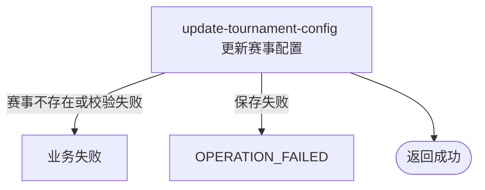

## 概要

由运营完整更新自办赛事配置并保留运营状态与进度。

## 触发

持有后台共享访问密钥的运营调用方要修改一个现有赛事的完整配置时发起。

## 接口契约

请求体为 `TournamentUpdateCmd`：必填赛事编号，并继承创建命令全部字段校验。成功返回标准成功响应且 `data=null`。

## 业务活动

- update-tournament-config  校验并覆盖赛事可配置字段，保留运营进度

## 流程图

## 详细流程

1. 后台共享 API Key 鉴权后，接收必填赛事编号及复用创建命令的完整配置与字段校验；不限制赛事当前为 DRAFT、ACTIVE 或 ABANDONED。
2. 按业务编号读取赛事，不存在则拒绝；执行与创建相同的签位、可选线下轮次、组人数、费用、奖金和时间关系校验；offlineFromRound 为空表示全程线上。
3. 将名称、图片键、主题、比赛类型、城市编码、NTRP、性别、签位、线下轮次、组人数、费用、奖金、时间、拒赛上限和规则映射到存量对象。
4. offlineFromRound 使用显式列更新，允许以空值清除并切换为全程线上；其他命令空值仍会被 MyBatis-Plus 实体更新忽略。城市编码可变但不会重新查询或同步城市名称。
5. 保留赛事状态、当前轮次、已锁定席位、冠军编号、结束时间、线下活动关联及其他运营数据，不联动报名、比赛、支付或匹配。
6. 更新在单事务内保存，失败回滚；成功返回无数据响应。

## 异常分支

| 对外失败码 | 触发条件 | 由哪个活动报出 | 补偿动作或超时处理 | 对外提示 |
|---|---|---|---|---|
| 无权限 | 后台共享 API Key 缺失或不匹配 | 后台鉴权 | 不更新 | 无权限访问 |
| 参数校验错误 | 赛事编号或完整配置字段不满足命令校验 | 入口校验 | 不更新 | 返回对应字段说明 |
| 赛事不存在 | 业务编号查无赛事 | update-tournament-config | 不更新 | 赛事不存在 |
| 业务规则错误 | 签位、线下轮次、数值或时间关系不合法 | update-tournament-config | 更新事务回滚 | 对应规则提示 |
| `OPERATION_FAILED` | 枚举转换或持久化异常 | update-tournament-config | 整个更新事务回滚 | 系统异常，请稍后重试 |

更新不限制赛事状态。offlineFromRound 可显式清空；其他可选字段传空会因实体更新策略保留数据库旧值；城市编码变更后城市名称仍为旧值。

## 技术线索

- HTTP：`POST /tournament/admin/update`
- 鉴权：`AdminApiKeyInterceptor`
- 请求：`TournamentUpdateCmd extends TournamentCreateCmd`
- 调用：`TournamentAdminAppService.update()` → `TournamentAdminService.update()`
- 映射：`TournamentDomainConvertMapper.updateTournamentData()`
- 保存：`TournamentRepositoryImpl.save()` 的实体更新；事务位于应用服务
