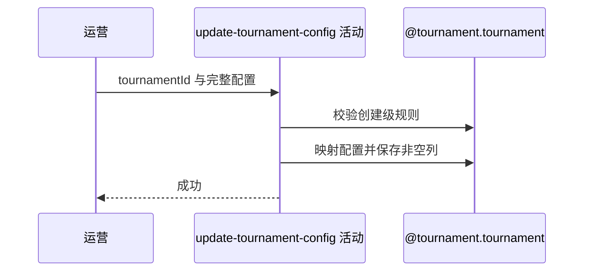

## 概要

覆盖赛事可配置字段，同时保留运营状态和进度。

## 时序图

## 触发条件

后台运营更新任意状态的现有赛事配置时执行。

## 活动契约

### 入参

| 字段 | 类型 | 必填 | 约束 |
|---|---|---|---|
| `tournamentId` | 字符串 | 是 | 必须命中现有赛事，不限制当前状态 |
| `config` | 完整赛事配置 | 是 | 复用创建级字段和跨字段校验；`offlineFromRound` 可为空 |

### 成功返回

| 字段 | 类型 | 必填 | 说明 |
|---|---|---|---|
| 无 | - | - | 配置保存成功后不返回数据 |

## 异常分支

| 错误标识 | 触发条件 | 来源 |
|---|---|---|
| `TOURNAMENT_NOT_FOUND` | 赛事编号无对应记录 | update-tournament-config 流程赛事不存在一行 |
| 参数/业务规则错误 | 创建级字段、签位、金额、奖金或时间关系非法 | update-tournament-config 流程参数/业务规则错误一行 |
| `OPERATION_FAILED` | 枚举转换或持久化失败 | update-tournament-config 流程同名错误一行 |

## 领域依赖

### @tournament.tournament

- 输入：存量赛事与完整配置
- 输出：保留运营进度的更新赛事

## 业务动作

- A1 校验完整配置。
- A2 映射可配置字段。
- A3 按非空更新策略保存。
- A4 保留运营进度与关联对象。

## 详细流程

1. A1 不限制当前状态；复用创建命令校验及签位、可选线下轮次、组人数、费用、奖金和时间关系，`offlineFromRound` 为空表示全程线上。
2. A2 映射名称、图片、主题、类型、城市编码、等级、性别、签位、费用、奖金、时间、拒绝上限和规则。
3. A3 `offlineFromRound` 通过显式列更新允许写 `null`；其他字段的空值被 MyBatis-Plus 实体更新忽略，故仍保留数据库旧值。
4. A2 城市编码可变却不重新查询或同步 `cityName`，可能留下编码名称不一致。
5. A4 `status`、`currentRound`、`currentFilledSlots`、`championEntryNo`、`endTime`、`offlineMeetupId` 等运营数据保留；不联动报名、比赛、支付或匹配。

## 边界情况

- ABANDONED 赛事也能更新配置。
- 可选字段无法通过 null 清除。
- 城市编码变化不会自动刷新城市名称。

## 实现提示

写入使用 `@tournament.tournament`，`reads` 为空；非空列策略是实现现状。
