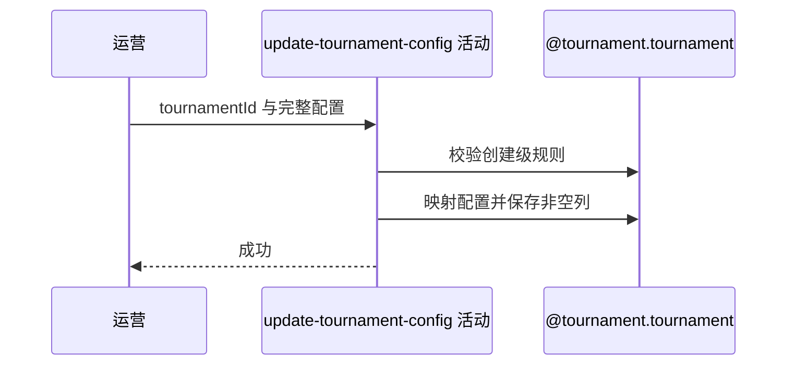

## 概要

覆盖赛事可配置字段，同时保留运营状态和进度。

## 时序图

## 触发条件

后台运营更新任意状态的现有赛事配置时执行。

## 活动契约

复用创建命令和跨字段规则覆盖配置；不限制 DRAFT/ACTIVE/ABANDONED。实体更新忽略 null，因此可选字段传空不能清库内旧值。

## 异常分支

| 错误标识 | 触发条件 | 处理 |
|---|---|---|
| 赛事不存在 | bizId 无赛事 | 不更新 |
| 参数/业务规则错误 | 创建级字段、签位、金额、奖金或时间关系非法 | 事务回滚 |
| `OPERATION_FAILED` | 枚举转换或持久化失败 | 整体回滚 |

## 领域依赖

### @tournament.tournament
- 输入：存量赛事与完整配置
- 输出：保留运营进度的更新赛事

## 业务动作

A1 校验完整配置
A2 映射可配置字段
A3 按非空更新策略保存
A4 保留运营进度

## 详细流程

1. 不限制当前状态；复用创建命令校验及签位、线下轮次、组人数、费用、奖金和时间关系。
2. 映射名称、图片、主题、类型、城市编码、等级、性别、签位、费用、奖金、时间、拒绝上限和规则。
3. 映射器可把空值写入内存，但 MyBatis-Plus 实体更新忽略 null，故可选字段传空保留数据库旧值。
4. 城市编码可变却不重新查询/同步 cityName，可能留下编码名称不一致。
5. status、currentRound、currentFilledSlots、endTime、offlineMeetupId 等运营数据保留；不联动报名、比赛、支付或匹配。

## 边界情况

- ABANDONED 赛事也能更新配置。
- 可选字段无法通过 null 清除。
- 城市编码变化不会自动刷新城市名称。

## 实现提示

写入使用 `@tournament.tournament`，`reads` 为空；非空列策略是实现现状。
